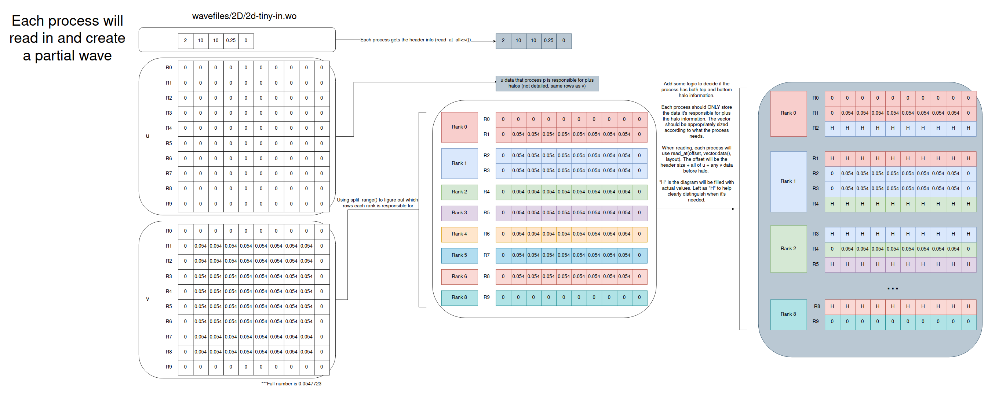
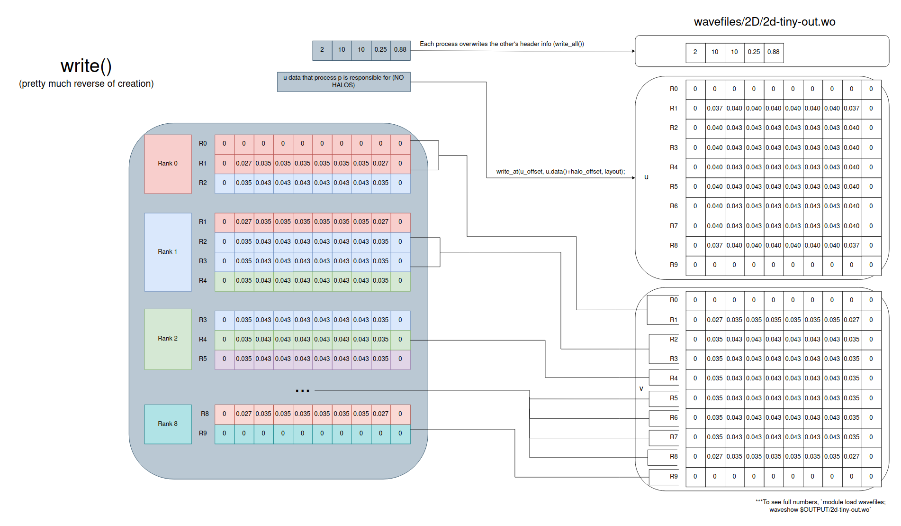
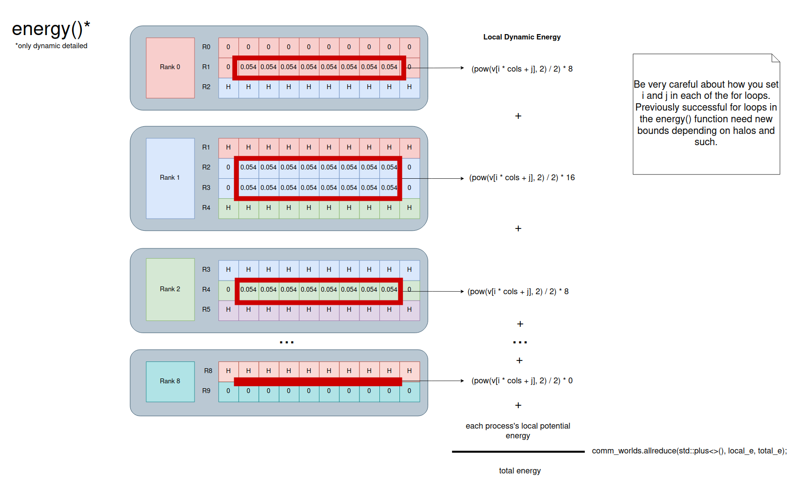
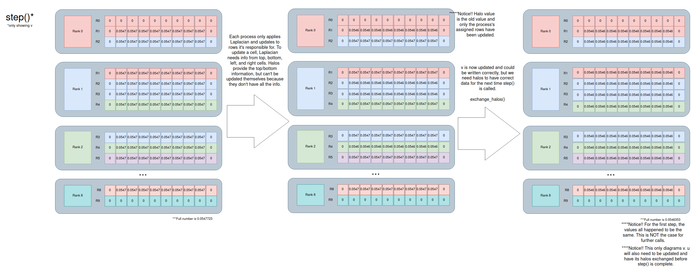

---
---

# Phase 7: MPI

In this assignment you'll parallelize your solver with [MPI](../readings/mpi.md). You can use [MPL](https://github.com/rabauke/mpl) [like in the example code](https://github.com/BYUHPC/sci-comp-course-example-cxx/blob/main/src/MountainRangeMPI.hpp), or the C bindings if you're more familiar with them. Most students will want to use the example code.

**This phase is significantly more challenging than previous phases for most students. Start early.** 


It's strongly recommend that you break it into two steps:

1. Get your I/O working--make an MPI program that reads in a [wave orthotope file](phase2.md#data-format) with [MPI I/O](../readings/mpi.md#io), prints the header and any other debug information you need, and writes back out an identical file with MPI I/O.
1. Once the I/O is working, figure out your `energy()` function, [exchange of halos](#division-of-labor), and your `solve()` function.

## Compiling

Load `gcc/14.1` and `openmpi/5.0` to get access to a recent MPI compiler, and `mpl` to use MPL.

## Reading and Writing

Much as in the [previous phase](phase6.md), you'll split work roughly evenly among processes. I recommend an approach similar to in the [example code](https://github.com/BYUHPC/sci-comp-course-example-cxx/blob/main/src/MountainRangeMPI.hpp), with each process being in charge of about $$\frac{R}{N}$$ whole rows (where $$R$$ is the number of rows and $$N$$ is the number of processes). Block partitioning is more efficient from a communications standpoint, but is harder to implement.

Since updating a cell of `u` requires data from the rows above and below it, the processes will need to store [ghost rows](https://sites.cs.ucsb.edu/~gilbert/cs140resources/notes/GhostCells.pdf) and exchange them on each iteration (see `exchange_halos` in the [example code](https://github.com/BYUHPC/sci-comp-course-example-cxx/blob/main/src/MountainRangeMPI.hpp)). It simplifies the complexitiy to also have `v` be in charge of the same corresponding rows and halos. 

Here's an example of how `2d-tiny-in.wo` would be divided up using `split_range()` and what the halos should look like:



Debugging MPI programs can be tricky. The ["Debugging, Profiling, and Optimization"](https://byuhpc.github.io/sci-comp-course/resources.html#debugging-profiling-and-optimization) section gives some resources you can turn to. If you want to do things the hard, old school way, you can `std::cout` information. You are not guaranteed to have process 0 print first followed by the others in order. Adding `#include <unistd.h>` and something like `sleep(1 * comm_rank);` can help with the timing issues.

Writing is very similar to the read, but in reverse. Make sure that each process only writes out the rows it's responsible for and NOT the halos.



Now that you can write, don't forget about [`wavefiles`](https://byuhpc.github.io/sci-comp-course/resources.html#the-project). It can be loaded with `module load wavefiles` or downloaded with [these instructions](https://byuhpc.github.io/sci-comp-course/resources.html#the-project). `wavediff` will help you quickly identify differences and `waveshow` will print the full input file. Use these liberally as you debug.

When you run with multiple processes on [NFS](https://en.wikipedia.org/wiki/Network_File_System) (the file system protocol we use), OpenMPI is astonishingly slow to allow MPI I/O writes by [default](https://github.com/open-mpi/ompi/blob/b79b3e9264ce7bfdb77ceb93aefc841af76addcf/ompi/mca/fs/ufs/fs_ufs_file_open.c#L89); it limits only 1 process to write at a time by locking. This can be changed with `export OMPI_MCA_fs_ufs_lock_algorithm=3`, which has a 0.1% chance of processes locking incorrectly in our case. As you develop read/writes, do NOT set this variable. Once your code works, set the environment variable and watch the MASSIVE speed ups. Run the program twice if you expected it to work or `unset OMPI_MCA_fs_ufs_lock_algorithm`. We will account for possible `OMPI_MCA_fs_ufs_lock_algorithm` related errors when grading.

## Energy

The `energy()` function is a great spot to make sure each process is only working on its assigned rows and not the halos. Before doing any stepping, `2d-tiny-in.out` has 0.096 for dynamic energy and 0 for potential energy. You can see that by running `waveshow $INPUT/2d-tiny-in.wo`. Each process should have it's own `double global_e, local_e` or something similar. `local_e` is the energy from the cells the process is in charge of. Once that's calculated, you can then call `comm_world.allreduce(std::plus<>(), local_e, global_e);` to have the processes exchange and sum up all the `local_e`s into the `global_e` variable.



## Step

If you can correctly calculate the energy, you're likely working with the correct cells. From there, we can work on the `step()` function. You'll update the cells the process is responsible for like normal, but then you'll need to swap the halos so you have up to date information the next time `step()` is called.

The `exchange_halos()` in the example code is great, but it only sends and receives one cell. 
```
comm_world.sendrecv(first_real_cell, comm_rank-1, left_tag,   // send
                    first_halo,      comm_rank-1, right_tag); // receive
```

We want to send a row of cells. The [MPI Reading](https://byuhpc.github.io/sci-comp-course/readings/mpi.html#communication) discusses MPL's `vector_layout` and how you can send multiple elements at a time.

```
auto layout = mpl::vector_layout<double>(15);
comm_world.send(v.data()+v.size()-15, layout, partner);
```

We can combine these principles to get something more like this:

```
auto layout = mpl::vector_layout<double>(num_cells_to_send);
comm_world.sendrecv(x.data()+cols, layout, comm_rank-1, left_tag, // send
                    x.data(), layout, comm_rank-1, right_tag); // receive
```

Feel free to rename things more appropriately for our project.

This is what `step()` looks like:



Food for thought: Depending on how you implement things, you might not need to exchange halos for `u` because it's only using `v` data which has been updated.

It can be hard to see what went wrong when you run the entire program to completion. Luckily, you already [implemented checkpointing](https://byuhpc.github.io/sci-comp-course/project/phase2.html). Since `dt=0.01`, setting `INTVL` to that or lower will get you checkpoint files at each step. Running `INTVL=0.01 wavesolve /path/to/2d-tiny-in.wo my_output.wo` will generate all the correct checkpoint files. 

## Requirements

The program must run on `2d-medium-in.wo` in 20 seconds given 4 processes on one full `m9` node and 4 processes on another (8 total processes). To get 2 nodes in an interactive job:
```shell
salloc --time=00:05:00 --mem 30G -N 2 --ntasks-per-node 28 -p m9
```

Inside a job with two full `m9` nodes, you can launch 4 processes per node with:

```shell
mpirun --npernode 4 wavesolve_mpi ...
```

If we see correct times, but slight inaccuracies when `OMPI_MCA_fs_ufs_lock_algorithm=3` is set, we'll test for accuracy with it unset.

## Submission

Update your `CMakeLists.txt` to create `wavesolve_mpi` (making sure to [compile with MPI](../readings/mpi.md#compilation)), develop in a branch named `phase7` or tag the commit you'd like me to grade from `phase7`, and push it.


## Grading

This phase is worth 30 points. The following deductions, up to 30 points total, will apply for a program that doesn't work as laid out by the spec:

| Defect | Deduction |
| --- | --- |
| Failure to compile `wavesolve_mpi` | 5 points |
| Failure of `wavesolve_mpi` to work on each of 3 test files | 5 points each |
| Failure of `wavesolve_mpi` to checkpoint correctly | 5 points |
| Failure of `wavesolve_mpi` to run on `2d-medium-in.wo` on two `m9` nodes with 4 threads each in 20 seconds | 5 points |
| ...in 60 seconds | 5 points |
| `wavesolve_mpi` isn't an MPI program, or doesn't distribute work evenly among processes | 1-30 points |
