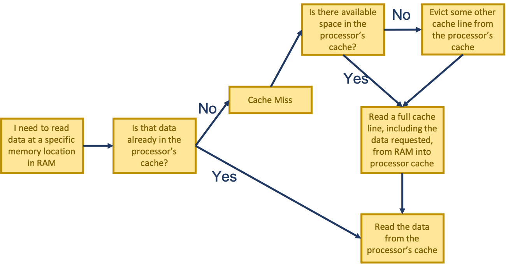

---
---

# Computer Architecture

## CPUs

Read [sections 1.1 to 1.3 of The Art of HPC volume 1](EijkhoutHPCTutorialsVol1.pdf#chapter.1). You don't need a deep understanding of that material and no details will appear on any quizzes or tests, but a general idea of how CPUs work is critical to programming for performance--skimming isn't quite enough, but you don't need to scrutinize every sentence or take detailed notes.

### Multi-core and Multiple CPUs

Most modern CPUs include multiple, distinct cores on the same physical chip. Each core operates mostly independent of each other. Even though there are multiple cores, each can still only execute one program at a time. Having multiple cores in operation does mean that multiple program threads or processes can be executed simultaneously, though.

In addition to multi-core machines, some computers will also have multiple physical CPU chips per computer. For example, our `m12` compute nodes each have 2 CPU chips/sockets, with each chip having 64 cores for a total of 128.

Most servers have 1, 2, or 4 chips. It gets increasingly hard to set up the communication architecture as that number increases. The number of communication paths between sockets increases dramatically as the number of sockets on the motherboard increases. Occasionally, a manufacturer will use some kind of a switch instead, but that [increases message latency](https://en.wikipedia.org/wiki/Non-uniform_memory_access). Since Memory Management Units (MMUs) are mostly on-chip now, increased latency between CPUs can significantly affect the time to access memory.

The communication fabric between these CPUs is generally a fully-connected mesh topology, where every endpoint has a direct connection to every other endpoint.

## Storage

In general, faster storage technology costs more per capacity than slower storage technology. Most often, only a small portion of data needs to be accessed at high speeds. Systems are thus usually designed with a series of storage tiers, utilizing many or most of the types of storage available--for example, a modern compute node on a supercomputer will usually have tiny, extremely fast SRAM CPU caches, small, fast DRAM main memory, a big, slow SSD for local storage, and huge, numerous, very slow hard drives making up remote storage.

| Storage type | Speed | Capacity | Cost per capacity |
| --- | --- | --- | --- |
| Remote storage | Glacial | Enormous | $ |
| Hard drive | Slow | Huge | $ |
| SSD | Moderate | Big | $$ |
| DRAM (main memory) | Fast | Small | $$$ |
| SRAM (CPU caches) | Lightning | Tiny | $$$$ |

### CPU Caches

Modern processors provide a small amount of SRAM in a series of core-specific or chip-level caches. These storage spaces are used to temporarily store data or instructions from DRAM (AKA main memory). When accessing a memory location, the processor checks its cache first before going to main memory. Going out to main memory to fetch something is orders of magnitude slower than getting it from cache.

When a processor needs to access a certain memory location in RAM, it first checks if that location has been loaded into the processor's cache. If it has, the data is read directly from the cache, but if it hasn't (a cache miss), main memory needs to be accessed (a very expensive operation): cache lines are evicted if there isn't enough room to store the data coming in from main memory, then the data is copied into the cache. Only then does the processor finally read the data, directly from the cache.

### Latency

Latency, the time it takes between when a CPU asks for data from a storage device and when it receives it, has a huge impact on performance since the CPU usually usually can't do anything while it's waiting. You should **know [how stark the difference in latency between storage types is](https://gist.github.com/jboner/2841832)**--the fact that accessing one byte from the best modern (as of 2023) SSDs, for example, takes at least *tens of thousands* of cycles should scare you into accessing storage and memory efficiently. [Using CPU caches efficiently is critical](http://gameprogrammingpatterns.com/data-locality.html) for performance.
