---
---
# Concurrency and Parallelism

## Introduction

Many large tasks can be broken into smaller, manageable pieces to improve efficiency. In computing, concurrency and parallelism allow multiple tasks to be divided in a way that they can progress independently, making better use of available resources.

For example, consider preparing a breakfast consisting of scrambled eggs, muffins, and sliced fruit. Some steps must happen sequentially:

- Cheese must be shredded before being added to the eggs.
- Muffin batter must be prepared before it is baked.

However, many tasks can overlap in progress:

- While waiting for the muffins to bake, eggs can be cooked.
- While waiting for the eggs to cook, fruit can be sliced.

For the sake of the following discussions, a chef in the kitchen is comparable to a CPU core, and a cooking task is comparable to a process or thread.

## Concurrency

[Concurrency](https://en.wikipedia.org/wiki/Concurrency_(computer_science)) is the ability of a system to manage multiple tasks at the same time. These tasks may not necessarily execute simultaneously but are interleaved by the [kernel](https://en.wikipedia.org/wiki/Kernel_(operating_system)) so that no task unfairly hoards all of the time on the processor.

Consider a single chef working in the kitchen to prepare breakfast. The chef may leave the muffins to bake and switch to cooking eggs, but the chef is never physically working on both tasks at once. Similarly, a computer with a single core interleaves multiple processes by rapidly switching execution between them. This is concurrency: multiple tasks making progress without necessarily running simultaneously.

Furthermore, the chef never spends a long, consecutive time on a single task in the kitchen. If the chef were to stay blissfully ignorant of the other items while watching the muffins bake, then the eggs may burn and the fruit would never be sliced. Instead, the chef frequently "checks in" on each task and spends a few moments with each before moving on to the next.

Physically, the switching of contexts and movement between the stove with the eggs to the cutting board with the fruit "wastes" some time where the chef is working on neither of the tasks. In a really busy kitchen, this movement could be constricted by extra bodies in the isles that slow down the time to change from one end of the kitchen to the other end. However, the nature of different tasks in the kitchen and also different kinds of computations on a computer necessitate this kind of rapid context switching to keep many different tasks moving forward with limited computational resources.

### Concurrency on Computers

```mermaid
---
displayMode: compact
---
%%{ init: { "themeVariables": { "disableZoom": true } } }%%
gantt
    title Concurrency on a Single-Core CPU
    dateFormat  X
    axisFormat %s
    tickInterval 1second

    section Task A
    TA  : taskA1, 0, 3
    TA  : taskA2, 6, 9
    A Complete :milestone, 9,

    section Task B
    TB  : taskB1, 3, 4
    TB  : taskB2, 12, 13
    TB  : taskB3, 15, 18
    B Complete :milestone, 18,

    section Task C
    TC  : taskC1, 4, 6
    TC  : taskC2, 9, 12
    TC  : taskC3, 13, 15
    C Complete :milestone, 15,
```

<!-- REPLACING THIS DIAGRAM WITH A SCREENSHOT

-->

A computer system is described as "executing concurrently" when a single CPU core is assigned multiple tasks. In this case, the core is only ever working on a single task at a time, although multiple tasks are overlapping in progress.

### Concurrent Eligibility

In the breakfast example, the muffins, eggs, and fruit can each be handled concurrently because they are independent of each other.

Mathematically, operations that follow the [associative property](https://en.wikipedia.org/wiki/Associative_property) (e.g., addition and multiplication) lend themselves well to concurrency:

$$1 + (2 + 3) = (1 + 2) + 3$$

$$1 \times (2 \times 3) = (1 \times 2) \times 3$$

These operations can be structured in a way that different segments of a computation can make progress without requiring strict ordering. However, not all kinds of computation can be reordered and cannot be broken into concurrent parts. For example:

$$1 \div (2 \div 3) \ne (1 \div 2) \div 3$$

Therefore, in order to make tasks compute faster, the designer must first find creative ways to break the task into smaller chunks while preserving the correct answer.

### Example

A classic computing example of concurrency is the `make` build system. A Makefile specifies dependencies between targets, forming a partial order. If certain targets are independent, `make` can schedule them to be built concurrently. However, if a system has only one CPU core, these independent tasks will not truly run at the same time; rather, the system will switch between them rapidly.

## Parallelism

Parallelism is a specific form of concurrency in which multiple tasks execute at the same time, requiring multiple CPU cores. While concurrency often requires structuring tasks to allow independent progress, parallelism is about physically executing multiple tasks simultaneously.

Returning to the breakfast example, concurrency allows the tasks to be interleaved, but true parallelism occurs if multiple people are cooking at the same time—one person frying eggs while another slices fruit and another bakes muffins. The work is not just structured efficiently; it is actually happening simultaneously. True parallelism requires a second chef to enter the kitchen and begin slicing the fruit while the first chef remains hard at work with the eggs. If labor shortages or kitchen capacity prevented a second chef from becoming involved in the meal preparation, then the overall process would not actually be performed in parallel.

Importantly, **parallelism requires concurrency, but not all concurrency leads to parallel execution**. A concurrent algorithm can execute in parallel if the hardware allows it, but on a single-core processor, it will still rely on context switching rather than true simultaneous execution.

### Parallelism on Computers

```mermaid
---
displayMode: compact
---
%%{ init: { "themeVariables": { "disableZoom": true } } }%%
gantt
    title Parallelism on a Multi-Core CPU
    dateFormat  X
    axisFormat %s
    tickInterval 1second

    section Task A
    TA  : taskA1, 0, 3
    TA  : taskA2, 3, 6
    A Complete :milestone, 6,

    section Task B
    TB  : taskB1, 0, 1
    TB  : taskB2, 1, 2
    TB  : taskB3, 2, 5
    B Complete :milestone, 5,

    section Task C
    TC  : taskC1, 0, 2
    TC  : taskC2, 2, 5
    TC  : taskC3, 5, 7
    C Complete :milestone, 7,
```

<!-- REPLACING THIS DIAGRAM WITH A SCREENSHOT

-->

In computing, parallelism occurs when multiple cores or processors execute independent tasks at the same time.

A system is described as "executing in parallel" when multiple cores are simultaneously computing different tasks.

Even when a computer has multiple cores, it may still be "executing concurrently" when there are more active processes than cores available. In this case, each of the cores individually handles multiple processes concurrently.

Modern consumer laptops typically have 4 to 8 cores. Often, some of these cores are optimized for power-efficient computations to preserve battery life, while others are optimized for high-performance computations.

On the BYU supercomputer, each compute node has between 20 and 128 cores, depending on the cluster. The exact details of each cluster can be viewed on the Research Computing website. In total, the BYU Supercomputer network currently has 34,948 CPU cores available for computation!

### Example

For example, in array summation, a concurrent approach might involve breaking the array into sections and scheduling computations to interleave on a single-core processor. A parallel approach, in contrast, would assign different sections to multiple CPU cores, where each core performs computations simultaneously before combining the results.

For more details, refer to [section 2.1 of HPC Tutorials volume 1](EijkhoutHPCTutorialsVol1.pdf#chapter.2).

## Real Example

The following Gantt chart illustrates the breakfast preparation process, highlighting how different chefs manage their tasks with varying degrees of concurrency and parallelism. By analyzing their workflows, we can better understand key concepts in task scheduling, efficiency, and system optimization.

```mermaid
gantt
title Breakfast Preparation — Full Example
dateFormat HH:mm
axisFormat %H:%M
tickInterval 5minute

section Chef A - Muffins, Eggs, Bacon
Start muffins              :milestone, a0, 00:00, 0
Gather muffin ingredients  :a1, after a0, 1m
Mix dry ingredients        :a2, after a1, 2m
Add wet ingredients        :a3, after a2, 1m
Put in blender             :a4, after a3, 1m
Pour into tray             :a5, after a4, 1m
Add blueberries            :a6, after a5, 30s
Bake muffins (20 min)      :active, a9, after a6, 20m
Add crumble                :a7, after a9, 30s
Finish muffins             :milestone, a23, after a7, 0m

Start eggs                 :milestone, a11, after a6, 0m
Gather egg ingredients     :a10, after a11, 1m
Boil eggs (12 min)         :active, a12, after a10, 12m
Poach 5 eggs               :a20, after a12, 6m
Crack 2 eggs               :a14, after a10, 30s
Scramble eggs              :a15, after a14, 2m
Crack 1 egg                :a16, after a15, 15s
Fry egg                    :a17, after a16, 2m
Shred cheese               :a18, after a17, 1m
Add cheese to eggs         :a19, after a18, 30s
Finish eggs                :milestone, a24, after a20, 0m

Start bacon                :milestone, a25, after a19, 0m
Heat grill (3 min)         :active, a13, after a25, 3m
Cook bacon                 :a21, after a23, 6m
Finish eggs and bacon      :milestone, a22, after a21, 0m


section Chef B - Fruit Prep
Start fruit                :milestone, b0, 00:00, 0m
Slice apples               :b1, after b0, 2m
Slice pears                :b2, after b1, 2m
Slice strawberries         :b3, after b2, 2m
Juice oranges              :b4, after b3, 5m
Finish fruit               :milestone, b7, after b4, 0m

Start table                :milestone, b8, after b7, 0m
Set tables                 :b5, after b4, 3m
Pour drinks                :b6, after b5, 2m
Finish table               :milestone, b8, after b6, 0m

section Chef C - Toast, Pancakes, Drinks
Start toast                :milestone, c0, 00:00, 0m
Gather toast ingredients   :c1, after c0, 1m
Slice bread                :c2, after c20, 1m
Toast bread                :active, c3, after c2, 4m
Butter toast               :c4, after c3, 1m
Serve toast                :c5, after c9, 1m
Finish toast               :milestone, c16, after c5, 0m

Start pancakes             :milestone, c17, after c1, 0m
Gather pancake ingredients :c6, after c17, 1m
Mix batter                 :c7, after c2, 3m
Heat pan                   :active, c8, after c7, 2m
Cook pancakes              :c9, after c8, 3m
Cook pancakes              :c21, after c5, 3m
Cook pancakes              :c22, after c25, 3m
Serve pancakes             :c10, after c22, 1m
Finish pancakes            :milestone, c18, after c10, 0m

Start drinks               :milestone, c19, after c6, 0m
Gather drinks ingredients  :c20, after c19, 1m
Begin boiling water        :c23, after c20, 30s
Boil water                 :active, c11, after c23, 4m
Begin coffee brewing       :c24, after c11, 30s
Brew coffee                :active, c12, after c24, 5m
Begin tea brewing          :c25, after c21, 30s
Brew tea                   :active, c13, after c25, 3m
Pour coffee & tea          :c14, after c18, 2m
Finish drinks              :milestone, c15, after c14, 0m
```

In the illustrated breakfast preparation process, the combined efforts of Chef A, Chef B, and Chef C form a parallel system where each chef operates independently to complete their assigned tasks. This system maximizes efficiency by allowing multiple food preparation processes to occur simultaneously rather than sequentially. Importantly, none of the chefs are required to wait on one another to complete their tasks; while this can prevent bottlenecks and ensure smooth workflow execution, it also leads to inefficiencies of it’s own.

### Chef Task Approaches and Their Computational Analogies

#### Chef A: Task Grouping with Limited Context Switching

Chef A’s workflow demonstrates an approach where a person completes as much of one task as possible before switching to another. The only exception to this occurs when a baking process begins, at which point Chef A shifts focus to another task while waiting. This strategy is highly efficient because it minimizes context switching, which in computing terms can be likened to reducing the overhead of switching between processes or threads. Chef A works on multiple tasks concurrently but organizes them to ensure minimal interruptions.

#### Chef B: Fully Sequential Processing

In contrast to Chef A, Chef B follows a strictly sequential approach, completing one task entirely before moving on to the next. However, this approach is viable in this scenario because Chef B’s tasks do not involve long cooking or baking processes that require waiting. This method can be directly compared to a single-threaded process in computing, where a program runs linearly without switching between tasks. While this approach is simple and avoids the overhead of task switching, it does not take advantage of concurrent execution and thus may not be the most efficient method in a high-demand system.

#### Chef C: High-Frequency Task Switching

Chef C adopts a different approach, frequently switching between tasks to make progress on multiple fronts. This mirrors how modern computers execute tasks by rapidly shifting between different processes at the microsecond level. While this method introduces more frequent context switching, it ensures that no single task is left idle for too long, effectively utilizing available time. This approach is often seen in multitasking operating systems where the CPU executes multiple processes by time-slicing.

### Challenges and Inefficiencies in the System

While the system overall demonstrates effective parallelism, a few inefficiencies emerge upon closer inspection:

1. **Delayed Breakfast Completion Due to Task Bottlenecks**
   - Although much of the breakfast preparation occurs in parallel, the entire meal is delayed by six minutes due to Chef A’s bacon cooking task. This represents a real-world challenge in concurrent programming: the difficulty of evenly distributing workload among multiple processing units. If another chef had taken on the bacon preparation earlier, the entire breakfast could have been completed sooner.

2. **Underutilization of Chef B’s Time**
   - Chef B completes all assigned tasks 13 minutes before the other chefs finish, leading to wasted potential. In computing, this corresponds to a processor or thread completing its task early but remaining idle while other components continue working. Ideally, work should be distributed so that all tasks conclude simultaneously for optimal efficiency.

3. **The Importance of Task Coordination in Computing and Cooking**
   - In a real breakfast preparation scenario, the chefs would likely coordinate to ensure all dishes are finished at the same time so that food does not cool before serving. Similarly, in computing environments, special scheduling strategies are used to ensure that tasks requiring synchronization complete together, rather than one process waiting unnecessarily for another.

4. **Idle Time During Long-Running Operations**
   - At various points, individual chefs experience idle time while waiting for certain tasks to finish, such as baking or boiling. This mirrors how CPUs sometimes have idle cycles when waiting for I/O operations, such as disk reads or network responses. Effective computing architectures attempt to minimize these idle cycles by scheduling additional tasks during wait periods.

### Computational Comparisons: Background Work and System Calls

Many of the lighter cooking tasks, such as baking, boiling, and brewing, do not require constant attention from the chef. These are similar to system calls in computing, where a process requests an operation (such as reading from a disk or fetching data from a database) and then continues performing other tasks while waiting for a response. Different system calls have varying durations, much like how boiling water takes longer than heating a pan. Understanding these dependencies is crucial for designing efficient concurrent systems.

### Optimizing the Breakfast Preparation System

Given these observations, several optimizations could be introduced to reduce the overall breakfast preparation time:

1. **Reassigning Tasks for Better Load Balancing**
   - Chef B could take on additional work, such as assisting with the bacon preparation or toasting, to prevent early task completion and unnecessary idle time.
   - Chef C could handle certain finalization tasks while other food items are still cooking to ensure a smooth serving process.

2. **Prioritizing Bottlenecked Tasks Earlier**
   - If the bacon task were started earlier, the overall breakfast completion time would decrease. In computing, this is similar to prioritizing tasks on the critical path of execution to avoid unnecessary delays.

3. **Coordinating Final Task Completion for Simultaneous Serving**
   - By adjusting the timing of each task, all food items could be ready at the same moment. This is akin to scheduling algorithms ensuring that interdependent processes complete in an optimal sequence.

### Questions for Consideration

Now that we've analyzed how different approaches to task management impact the efficiency of breakfast preparation, it’s time to step back and consider the broader implications. The following questions encourage you to think critically about scheduling, workload distribution, and optimization—both in the kitchen and in computing systems.

1. **Balancing Workload** – Chef B finishes all tasks significantly earlier than the others. How could the work be redistributed to ensure that all chefs finish at the same time? What principles from computing could help optimize this scheduling?

2. **Minimizing Idle Time** – There are moments when a chef is waiting for an item to finish cooking before continuing. In computing, this is comparable to CPU idle time. What strategies could be used to reduce these idle periods and keep all chefs (or CPU cores) actively engaged?

3. **Trade-offs in Task Switching** – Chef A minimizes context switching, while Chef C frequently switches between tasks. Which approach is better suited for different types of workloads in computing, and why? How do factors like task complexity, dependencies, and processing power affect this decision?

4. **Real-World Scheduling** – In large-scale computing systems, load balancers and schedulers determine how tasks are distributed. If you were designing a task scheduler for this breakfast preparation, how would you assign work to maximize efficiency?

5. **Concurrency Pitfalls** – The system experiences an unnecessary bottleneck when breakfast is delayed by the bacon cooking last. What are real-world examples of similar bottlenecks in computing, and how can they be mitigated?

6. **Parallelism vs. Concurrency** – Chef B works sequentially, Chef A works concurrently, and Chef C demonstrates an interleaved approach. What types of real-world computing tasks best align with each of these strategies?

7. **Scalability** – If a fourth chef joined the kitchen, what changes could be made to further improve efficiency? How does this concept apply to adding more processors or threads in computing?

### Conclusion

This breakfast preparation example serves as an insightful analogy for concurrency and parallelism in computing. The different approaches taken by each chef—Chef A’s task grouping, Chef B’s sequential execution, and Chef C’s rapid switching—reflect real-world computing strategies. By studying the inefficiencies in this system, we gain valuable insights into how concurrent systems can be optimized to improve efficiency, reduce idle time, and ensure a balanced workload distribution. Just as chefs must carefully coordinate their efforts to serve a perfectly timed meal, computer systems must employ intelligent scheduling strategies to maximize performance and minimize wasted resources.
