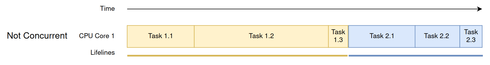
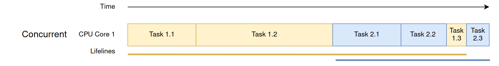
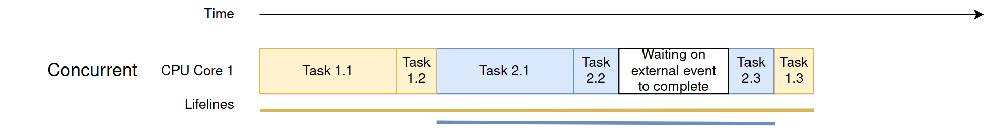
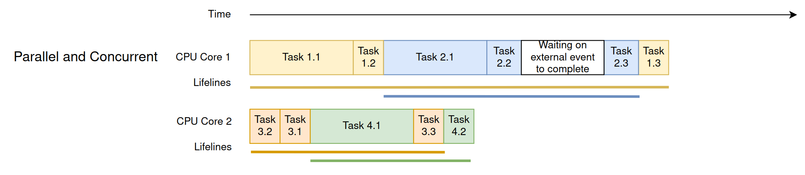

---
---
# Concurrency and Parallelism

## Introduction
Concurrency and parallelism both deal with "doing more than one thing,” but they solve different problems. Concurrency is about *managing* multiple tasks so they can make progress during the same period. Parallelism is about *executing* multiple tasks at the same instant.

Read [section 2.1 of HPC Tutorials volume 1](EijkhoutHPCTutorialsVol1.pdf#chapter.2).

## Concurrency

[Concurrency](https://en.wikipedia.org/wiki/Concurrency_(computer_science)) is the ability of a system to manage multiple tasks at once. To enable this, units of the program, algorithm, or problem must be able to be executed out-of-order or in partial order without affecting the final outcome. Concurrency can be achieved on a single CPU core by interleaving tasks (time-slicing) or on multiple cores; what matters is that tasks overlap in time, even if they aren’t running at the exact same moment.

On a single core, the [kernel](https://en.wikipedia.org/wiki/Kernel_(operating_system)) interleaves tasks so each makes progress within the same timeframe. To interleave tasks, at least one task must be able to have its progress paused and resumed. When tasks run concurrently, their lifelines overlap on a timeline. Concurrency helps systems stay responsive, especially when some tasks are waiting (e.g., for I/O).

Mathematically, operations that follow the [associative property](https://en.wikipedia.org/wiki/Associative_property) (e.g., addition and multiplication) lend themselves well to concurrency:

$$1 + (2 + 3) = (1 + 2) + 3$$

$$1 \times (2 \times 3) = (1 \times 2) \times 3$$

These operations can be structured in a way that different segments of a computation can make progress without requiring strict ordering. However, not all kinds of computation are not reorderable and thus cannot be broken into concurrent parts. For example:

$$1 \div (2 \div 3) \ne (1 \div 2) \div 3$$

To make work complete sooner via concurrency, a programmer first looks for ways to split the task into smaller, order-relaxed chunks while preserving correctness. This is often acheived by overlapping time spent waiting with useful work.

Let's look at an example. Chef Core is making dinner (the “correct answer”) with these tasks:

Task 1: Make Soup
1.1 Prepare ingredients - 30 minutes
1.2 Simmer soup - 60 minutes
1.3 Dish up soup - 5 minutes

Task 2: Make Breadsticks
2.1 Knead dough (we're bad bakers so we don't let it rise) - 30 minutes
2.2 Bake breadsticks - 20 minutes
2.3 Plate breadsticks - 5 minutes

Total time (purely serial): 150 minutes

If Chef Core cannot run concurrently, he completes the tasks in the listed order. It takes him over 2 hours, and his soup is dished up before he even starts making breadsticks. This takes too long and results in cold soup.

Chef Core knows about concurrency and decides to partially reorder the tasks like so:

1.1 Prepare ingredients - 30 minutes
1.2 Simmer soup - 60 minutes 
2.1 Knead dough - 30 minutes
2.2 Bake breadsticks - 20 minutes
1.3 Dish up soup - 5 minutes
2.3 Plate breadsticks - 5 minutes

Total time: 150 minutes

Now both the soup and the breadsticks can be served at roughly the same time! Because the main tasks overlap, Chef Core is running concurrently. 

He also realizes that he's spending a lot of time waiting for the soup to simmer and the breadsticks to bake. These are external events where he isn't working. On a real CPU core, this might be waiting for the filesystem to fetch/write a file, waiting for the network to return something, waiting for user input, etc. Since Chef Core knows he's not working, he decides to switch tasks and come back to them once the external event has completed.

1.1 Prepare ingredients - 30 minutes
1.2 Simmer soup - 5 minute set up
2.1 Knead dough - 30 minutes
2.2 Bake breadsticks - 5 minute set up
3.0 Check on soup and breadsticks - 15 minutes
2.3 Plate breadsticks - 5 minutes
1.3 Dish up soup - 5 minutes

Total time: 95 minutes

This drastically cuts down the time spent waiting around. Chef Core is an expert at managing tasks concurrently.

## Parallelism
Parallelism is when multiple units of work execute at the same time (e.g., on multiple cores, CPUs, or hardware units). Parallelism is one way to realize concurrency: not all concurrent programs run in parallel, but all parallel execution implies concurrent tasks. Parallelism primarily improves throughput for CPU-bound work by using additional compute resources.

Chef Core now adds a salad and dessert but still has only 95 minutes. He hires Sous-Chef Second Core and adds the following tasks:

Task 3: Make Salad
3.1 Chop lettuce - 5 minutes
3.2 Dice tomato - 5 minutes
3.3 Add dressing - 5 minutes

Task 4: Decorate a Cake
4.1 Frost the cake - 30 minutes
4.2 Cut the cake - 5 minutes

On the night, the sous-chef does 3.2 before 3.1 and then 4.1 before finishing the salad. There’s no strict ordering, so the sequence is unusual but valid for concurrency. With two cooks working at once, Chef Core and the sous-chef are in parallel until the sous-chef finishes. Parallelism lets them complete more work in the same wall-clock time.

