---
---
# Concurrency and Parallelism

## Introduction

Many large tasks can be broken into smaller, manageable pieces to improve efficiency. In computing, concurrency and parallelism allow multiple tasks to be divided in a way that they can progress independently, making better use of available resources.

For example, consider preparing a breakfast consisting of scrambled eggs, muffins, and sliced fruit. Some steps must happen sequentially:

- Cheese must be shredded before being added to the eggs.
- Muffin batter must be prepared before it is baked.

However, many tasks can overlap in progress:

- While waiting for the muffins to bake, eggs can be cooked.
- While waiting for the eggs to cook, fruit can be sliced.

For the sake of the following discussions, a chef in the kitchen is comparable to a CPU core, and a cooking task is comparable to a process or thread.

## Concurrency

[Concurrency](https://en.wikipedia.org/wiki/Concurrency_(computer_science)) is the ability of a system to manage multiple tasks at the same time. These tasks may not necessarily execute simultaneously but are interleaved by the [kernel](https://en.wikipedia.org/wiki/Kernel_(operating_system)) so that no task unfairly hoards all of the time on the processor.

Consider a single chef working in the kitchen to prepare breakfast. The chef may leave the muffins to bake and switch to cooking eggs, but the chef is never physically working on both tasks at once. Similarly, a computer with a single core interleaves multiple processes by rapidly switching execution between them. This is concurrency: multiple tasks making progress without necessarily running simultaneously.

Furthermore, the chef never spends a long, consecutive time on a single task in the kitchen. If the chef were to stay blissfully ignorant of the other items while watching the muffins bake, then the eggs may burn and the fruit would never be sliced. Instead, the chef frequently "checks in" on each task and spends a few moments with each before moving on to the next.

Physically, the switching of contexts and movement between the stove with the eggs to the cutting board with the fruit "wastes" some time where the chef is working on neither of the tasks. In a really busy kitchen, this movement could be constricted by extra bodies in the isles that slow down the time to change from one end of the kitchen to the other end. However, the nature of different tasks in the kitchen and also different kinds of computations on a computer necessitate this kind of rapid context switching to keep many different tasks moving forward with limited computational resources.

### Concurrency on Computers

<!-- REPLACING THIS DIAGRAM WITH A SCREENSHOT

-->

A computer system is described as "executing concurrently" when a single CPU core is assigned multiple tasks. In this case, the core is only ever working on a single task at a time, although multiple tasks are overlapping in progress.

### Concurrent Eligibility

In the breakfast example, the muffins, eggs, and fruit can each be handled concurrently because they are independent of each other.

Mathematically, operations that follow the [associative property](https://en.wikipedia.org/wiki/Associative_property) (e.g., addition and multiplication) lend themselves well to concurrency:

$$1 + (2 + 3) = (1 + 2) + 3$$

$$1 \times (2 \times 3) = (1 \times 2) \times 3$$

These operations can be structured in a way that different segments of a computation can make progress without requiring strict ordering. However, not all kinds of computation can be reordered and cannot be broken into concurrent parts. For example:

$$1 \div (2 \div 3) \ne (1 \div 2) \div 3$$

Therefore, in order to make tasks compute faster, the designer must first find creative ways to break the task into smaller chunks while preserving the correct answer.

### Example

A classic computing example of concurrency is the `make` build system. A Makefile specifies dependencies between targets, forming a partial order. If certain targets are independent, `make` can schedule them to be built concurrently. However, if a system has only one CPU core, these independent tasks will not truly run at the same time; rather, the system will switch between them rapidly.

## Parallelism

Parallelism is a specific form of concurrency in which multiple tasks execute at the same time, requiring multiple CPU cores. While concurrency often requires structuring tasks to allow independent progress, parallelism is about physically executing multiple tasks simultaneously.

Returning to the breakfast example, concurrency allows the tasks to be interleaved, but true parallelism occurs if multiple people are cooking at the same time—one person frying eggs while another slices fruit and another bakes muffins. The work is not just structured efficiently; it is actually happening simultaneously. True parallelism requires a second chef to enter the kitchen and begin slicing the fruit while the first chef remains hard at work with the eggs. If labor shortages or kitchen capacity prevented a second chef from becoming involved in the meal preparation, then the overall process would not actually be performed in parallel.

Importantly, **parallelism requires concurrency, but not all concurrency leads to parallel execution**. A concurrent algorithm can execute in parallel if the hardware allows it, but on a single-core processor, it will still rely on context switching rather than true simultaneous execution.

### Parallelism on Computers

<!-- REPLACING THIS DIAGRAM WITH A SCREENSHOT

-->

In computing, parallelism occurs when multiple cores or processors execute independent tasks at the same time.

A system is described as "executing in parallel" when multiple cores are simultaneously computing different tasks.

Even when a computer has multiple cores, it may still be "executing concurrently" when there are more active processes than cores available. In this case, each of the cores individually handles multiple processes concurrently.

### Example

For example, in array summation, a concurrent approach might involve breaking the array into sections and scheduling computations to interleave on a single-core processor. A parallel approach, in contrast, would assign different sections to multiple CPU cores, where each core performs computations simultaneously before combining the results.

For more details, refer to [section 2.1 of HPC Tutorials volume 1](EijkhoutHPCTutorialsVol1.pdf#chapter.2).

## Real Example

```mermaid
gantt
title Breakfast Preparatin — Full Example
dateFormat HH:mm
axisFormat %H:%M
tickInterval 5minute

section Chef A - Muffins, Eggs, Bacon
Start muffins              :milestone, a0, 00:00, 0
Gather muffin ingredients  :a1, after a0, 1m
Mix dry ingredients        :a2, after a1, 2m
Add wet ingredients        :a3, after a2, 1m
Put in blender             :a4, after a3, 1m
Pour into tray             :a5, after a4, 1m
Add blueberries            :a6, after a5, 30s
Bake muffins (20 min)      :active, a9, after a6, 20m
Add crumble                :a7, after a9, 30s
Muffins ready              :milestone, a23, after a7, 0m

Start eggs                 :milestone, a11, after a6, 0m
Gather egg ingredients     :a10, after a11, 1m
Boil eggs (12 min)        :active, a12, after a10, 12m
Poach 5 eggs              :a20, after a12, 6m
Crack 2 eggs              :a14, after a10, 30s
Scramble eggs             :a15, after a14, 2m
Crack 1 egg               :a16, after a15, 15s
Fry egg                   :a17, after a16, 2m
Shred cheese              :a18, after a17, 1m
Add cheese to eggs        :a19, after a18, 30s
Eggs ready                :milestone, a24, after a20, 0m

Start bacon               :milestone, a25, after a19, 0m
Heat grill (3 min)        :active, a13, after a25, 3m
Cook bacon                :a21, after a23, 6m
Finish eggs and bacon     :milestone, a22, after a21, 0m


section Chef B - Fruit Prep
Start fruit               :milestone, b0, 00:00, 0m
Slice apples              :b1, after b0, 2m
Slice pears               :b2, after b1, 2m
Slice strawberries        :b3, after b2, 2m
Juice oranges             :b4, after b3, 5m
Finish fruit              :milestone, b7, after b4, 0m

Start table               :milestone, b8, after b7, 0m
Set tables                :b5, after b4, 3m
Pour drinks               :b6, after b5, 2m
Finish table              :milestone, b8, after b6, 0m

section Chef C - Toast, Pancakes, Drinks
Gather toast ingredients  :c1, 00:00, 1m
Slice bread               :c2, after c1, 1m
Toast bread               :c3, after c2, 4m
Butter toast              :c4, after c3, 1m
Serve toast               :c5, after c4, 1m

Gather pancake ingredients:c6, after c5, 1m
Mix batter                :c7, after c6, 3m
Heat pan                  :c8, after c7, 2m
Cook pancakes (3 batches) :c9, after c8, 9m
Serve pancakes            :c10, after c9, 1m

Boil water                :c11, after c10, 4m
Brew coffee               :c12, after c11, 5m
Brew tea                  :c13, after c12, 3m
Pour coffee & tea         :c14, after c13, 2m
Drinks ready              :milestone, c15, after c14, 0m
```

