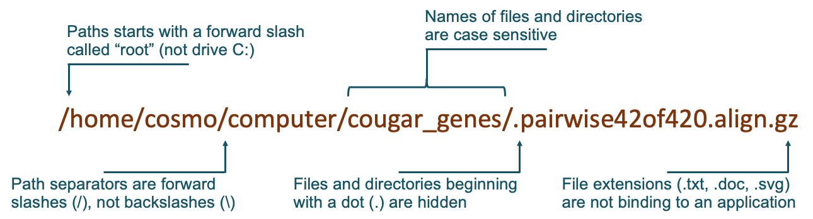

---
---

# Navigating Filesystems

The first thing you’ll encounter with the Linux shell is the filesystem. You are already familiar with filesystems. Whenever you work with folders, directories, and files on a computer, you are working with a filesystem. The difference with the Linux shell is that, instead of using a mouse to click through graphical representations of folders and files, you navigate it with commands that you type.

## Filesystem

A filepath starts with a forward slash called 'root'. This indicates the beginning of the directory tree. Each directory or folder is then separated by another forward slash. It's important to note that files and directories are case sensitive. If a file or directory begins with a dot (.), it is considered hidden. Once your path gets to its final directory and you choose a file to work with, you are not constrained by the file extension to work with a specific application. Rather, you can use many applications to perform the needed tasks.



There are two special links within a directory, "`.`" and "`..`". A single dot points to the directory in which it resides, and a double dot points to the parent directory.


### Absolute vs Relative Paths

Absolute paths always begin with the root-slash. This is a full path to the directory or file that you are working with.

```
/home/cosmo/computer/cougar_genes/pairwise42of420.align.gz
```

Relative paths do not start with the root-slash. They are relative to your current location on the filesystem and make use of the single- and double-dot links within a directory. For example, if your current working directory was `/home/cosmo/computer`, then you can use these relative paths instead of the absolute path:

```
./cougar_genes/pairwise42of420.align.gz
cougar_genes/pairwise42of420.align.gz
```

### Wildcards

Wildcards allow you to select files conforming to a pattern. We'll go through more in a future lesson, but the most useful wildcard is `*`, denoting any number of any characters:

```shell
$ ls
blah.txt  file1  file2  otherthing.txt  something.txt
$ ls *thing.txt
otherthing.txt  something.txt
```


## Shell Commands

You should know the following shell commands. Run the listed examples on the supercomputer to see what they do.

| Command | Meaning | Run these examples |
| --- | --- | --- |
| `ls` | List contents of a directory or a file | `ls`<br/>`ls -a`<br/>`ls -lh`<br/>`ls /apps` |
| `touch` | Create an empty file if none exists | `touch ~/.bash_history` |
| `pwd` | Print the current working directory | `pwd` |
| `cd` | Changes directory | `cd /tmp && pwd`<br/>`cd && pwd`<br/>`cd .. && ls` |
| `cp` | Copies files | `cp ~/.bash_history ~/DELETEME` |
| `mv` | Move or rename files | `mv ~/DELETEME /tmp/` |
| `rm` | Removes files | `rm /tmp/DELETEME` |
| `mkdir` | Creates directories | `mkdir /tmp/mydir` |
| `*` | Wildcard pattern | `ls -d /apps/j*` |
| `cat` | Print files to screen, or create text files | `cat ~/.bash_history` |
| `grep` | Search for a pattern | `grep 'ls' ~/.bash_history` |
| `sort` | Sort alphabetically or numerically | `seq 15 | sort`<br/>`seq 15 | sort -n` |

Arguably the most important command is `man` (as in *manual*). Run `man [command]` to learn about a command--for example, `man ls` will give you details on how to use `ls`. Within a `man` page, you can search for "somestring" by typing `/somestring`. Exit by typing "`q`".

The arguments that come after a command, conventionally starting with a dash, are called **options**. They change behavior:

```shell
ls -l   # detailed long list
ls -h   # human readable size
ls -lhR # detailed, human-readable, recursive
```

Some options come in a single-dashed 'short' variety and a double-dashed 'long' variety; the following two commands are equivalent:

```shell
ls -hRr
ls --human-readable --recursive --reverse
```
