---
---

# Git

## Version Control

How do you back up your projects? Here are what some people consider backups: 

-  pushing the save button on Microsoft Word
-  emailing a copy of a document to yourself
-  saving to a USB or hard drive
-  saving to the cloud (e.g., Google Drive)  

And what about keeping versions of projects? Versioning is to keep snapshots of a project as it progresses. Many students email themselves a copy of a paper each time it reaches a significant milestone. Sometimes our versioning tells a tragic story:


Version control is a solution to these issues. Good version control will

- properly maintain snapshots of a project
- facilitate easy collaboration
- keep a detailed history of a project
- be stored in multiple physical locations


## Git Basics

Git is the most popular version control software today.

If you're setting up Git for the first time, it's valuable to configure your name, email, and the text editor you intend to use, like so:

```bash
$ git config --global user.name 'Your Name'
$ git config --global user.email 'your@email.com'
$ git config --global core.editor 'vim'
```

### Overview

Let's say you have two text files that you want to manage with git: `README.txt` and `hello.sh`. Where do you start?

`README.txt`:
```
This is a bash script that will print out, "Hello, world!"
```

`hello.sh`:
```bash
#!/bin/bash
echo 'Hello, world!'
```

First, while in the directory where those files reside, run the following commands; each line's function is explained in the comments:

```bash
git init                        # creates an empty repository
git add README.txt hello.sh     # adds the two test files to the staging area
git commit -m "Initial Commit"  # commits a snapshot of files
```

### Initialize a Repo

```
git init
```

This creates a hidden directory named .git in the current location. The directory contains an empty git repository. Your current location becomes your working directory, meaning it and its subdirectories can be managed with git. Any files in your working directory start as untracked. Files in the working directory can fall into one of three categories:

- untracked: git doesn't track them
- unmodified: the file hasn't been changed since the last commit
- modified: the file has been changed since the last commit

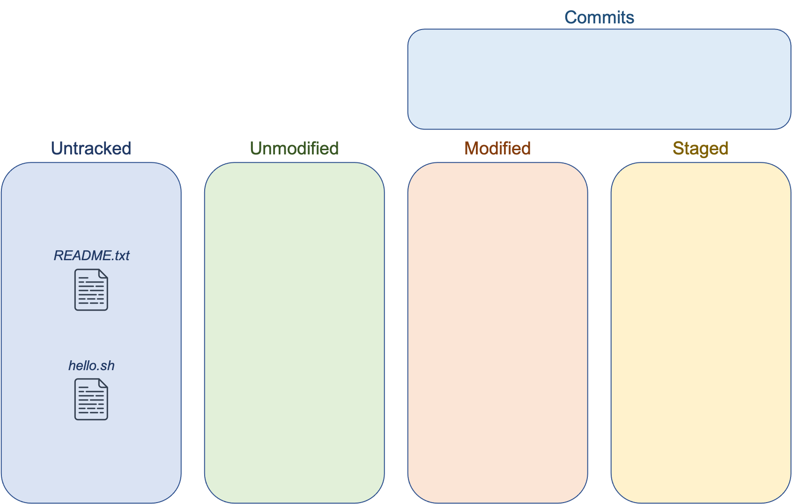

You can use the command `git status` to see the current state of your working directory. Currently, both `README.txt` and `hello.sh` are untracked:

```shell
$ git status
On branch master

Initial commit

Untracked files:
  (use "git add <file>..." to include in what will be committed)

    README.txt
    hello.sh

nothing added to commit but untracked files present (use "git add" to track)
```

### Add to the Staging Area

```shell
git add README.txt hello.sh # adds the two test files to the staging area
```

Running git add will add specified files to the staging area. Think of the staging area as a loading bay to put files that you plan to save in a snapshot. Once a file is added to the staging area, it is tracked for modifications. 

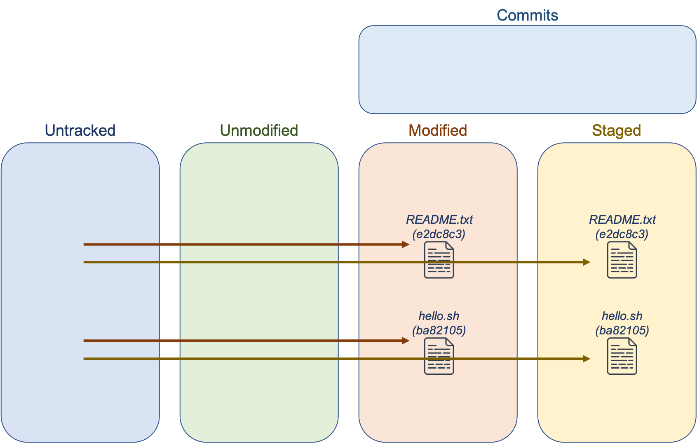

Running `git status` again, we can see that git recognizes that there are new files in the staging area:

```shell
$ git status
On branch master

Initial commit

Changes to be committed:
  (use "git rm --cached <file>..." to unstage)

    new file:    README.txt
    new file:    hello.sh

nothing added to commit but untracked files present (use "git add" to track)
```

### Commit Changes

```shell
git commit -m "Initial Commit" # commits a snapshot of files
```

When you run `git commit`, a snapshot of the staged files is created. Once committed, the files are considered unmodified. Commits require that you include a message related to the commit, and the message for the first commit is typically "Initial Commit".

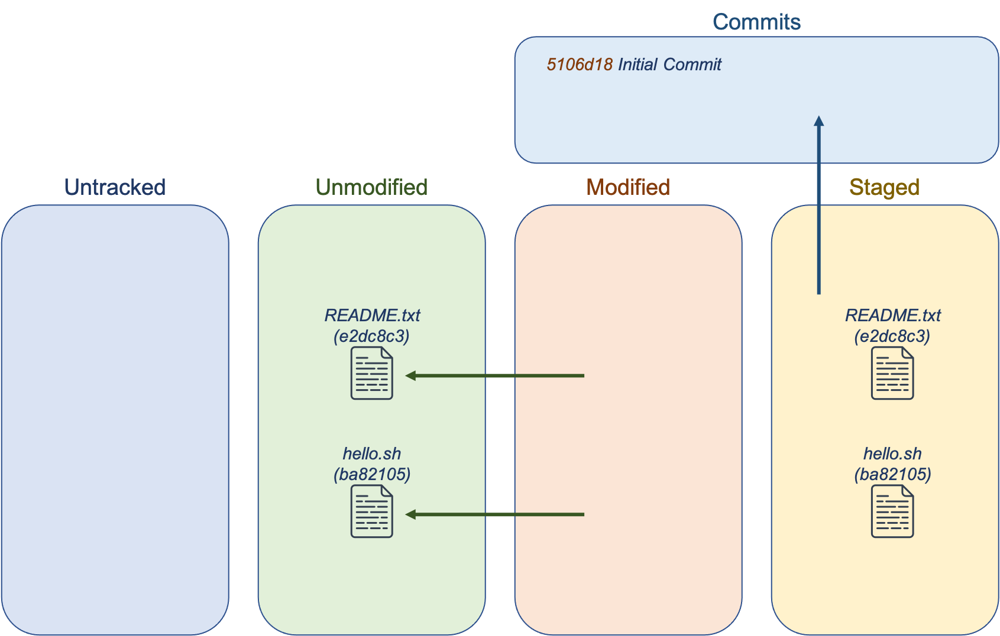

After a commit, `git status` will report that there is nothing more to commit. Valuable is the `git log` command, which displays a historical log of commits:

```shell
$ git status
On branch master
nothing to commit, working directory clean

$ git log
commit 5106d185ccd24764b8757e53d29ee9032eb14c37
Author: Cosmo Cougar <cosmo@byu.edu>
Date    Mon Dec 21 12:24:34 2015 -0700

    Initial Commit
```

Note the long string of 40 hexadecimal characters. This is called the commit object. 

### The Commit Object

Commit objects contain details relating to each commit. Every commit is identified by a 40 character SHA-1 hash. When referencing a hash in a git command, it can be referenced by fewer characters as long as it is unique.

Within the commit object, you can find the following additional information: snapshot, parent, author, and committer. **Snapshots** contain the staged files in their exact state when committed, and the commit object points to a particular snapshot of files. Each commit object (except commit #1) has a pointer to the previous commit, called a **parent**. This enables git to keep a historical record of commits and file changes made during the lifetime of a project. It also allows you to revert to previous snapshots. Each commit object also records information about the **author** and **committer** such as name, email, and date and time of the commit. This creates trackable accountability of everyone's contributions, which is why we suggested you configure git to know your name and email address.

### Modifying Files

What if we wanted to modify the [files above](#overview) to say "Hello, Cosmo!" instead of "Hello, World!"? What happens to the file in Git? Git keeps a hash of each tracked file to detect when it has changed. When you modify the files, Git will detect it and add it to the modified group.

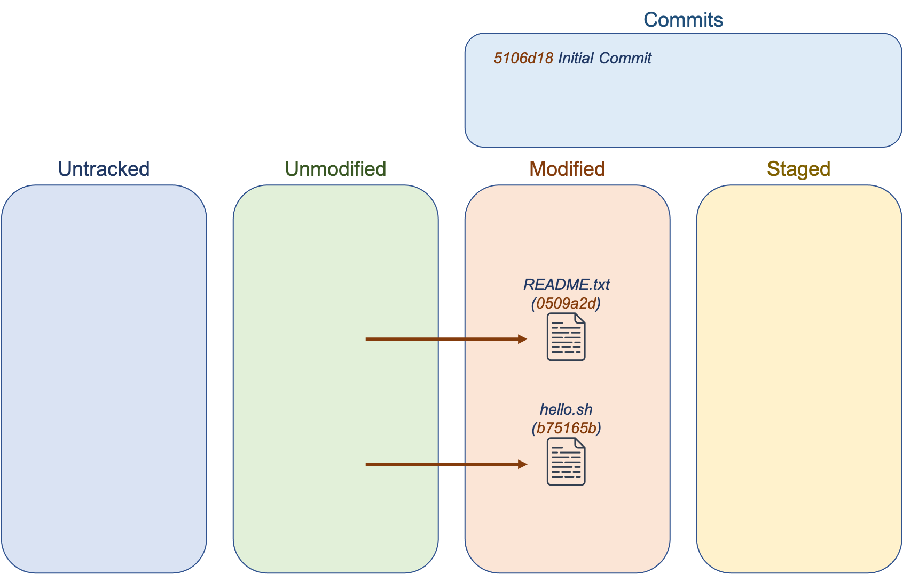

You can check this with `git status`:

```shell
$ git status
On branch master
Changes not staged for commit:
  (use "git add <file>..." to update what will be committed)
  (Use "git checkout -- <file>..." to discard changes in working directory)

     modified:    README.txt
     modified:    hello.sh

no changes added to commit (use "git add" and/or "git commit -a")
```

We now know that if we want to commit the files, we need to stage them and then commit them, like so:

```shell
$ git add README.txt hello.sh // add files to staging area
$ git commit -m "Cosmo"
[master b501eb8] Cosmo
  2 files changed, 2 insertions(+), 2 deletions(-)
```

The new commit will have a new hash associated with it, and the files are once again considered unmodified. The commit object will be updated, this time having a parent of the initial commit.


### Remove or Rename a File

Removing a file that is under git control is not as simple as running `rm` on it. You have to run `git rm [filename]` so that the change can be properly reflected in git as well. 

When `git rm` is run, two things happen. First, the file is removed from the staging area. Second, the file itself is deleted. If you ran the regular `rm` on the file, it would be deleted, but the change wouldn't be in the staging area for the next commit. You'll need to commit the changes for them to be reflected in a new snapshot.

Likewise, you need to use `git mv [filename]` instead of just `mv` to rename or move a file so that Git properly updates the staging area.

### History and Differences

After making changes to files, you may be interested in viewing the history of commits or the differences between various commits. The command `git log` provides a full audit trail. You can see who committed changes and when. You can also revert your working directory to the state of a previous commit. The command `git diff [hash1] [hash2]` is an invaluable tool for comparing differences in commits. You can give the hashes of two commits as arguments, and git will provide a color-coded listing of line-by-line differences between the two commits.

```shell
$ git log
commit b501eb86ac35a6d71ccf37eac213ed461f97ef9c
Author: Cosmo Cougar <cosmo@byu.edu>
Date:   Mon Dec 21 12:47:38 2015 -0700

  Cosmo

commit 5106d185ccd24764b8757e53d9ee9032eb14c37
Author: Cosmo Cougar <cosmo@byu.edu>
Date:   Mon Dec 21 12:24:34 2015 -0700

  Initial Commit
$
$ git diff 5106d18 b501eb8
diff --git a/README.txt b/README.txt
index e2dc8c3..0509a2d 100644
-- a/README.txt
+++ b/README.txt
@@ -1 1 @@
-This is a bash script that will print out, "Hello, world!"
+This is a bash script that will print out, "Hello, Cosmo!"
diff --git a/hello.sh b/hello.sh
index ba82105..b75165b 100644
--- a/hello.sh
+++ b/hello.sh
@@ -1,2 +1,2 @@
 #!/bin/bash
-echo 'Hello, world!'
+echo 'Hello, Cosmo!'
```


## Git Branches

Branches are an extremely lightweight tool to manage workflows. Branches are just a movable pointer to a particular commit. The branch you start on is called "master" (or "main" in [newer versions](https://github.com/github/renaming?tab=readme-ov-file#renaming-the-default-branch-from-master)) by default. Every time you commit, the current branch's pointer moves to the new commit object. Note that there is also a special HEAD reference that points to the current branch you're on. This may or may not be the master.

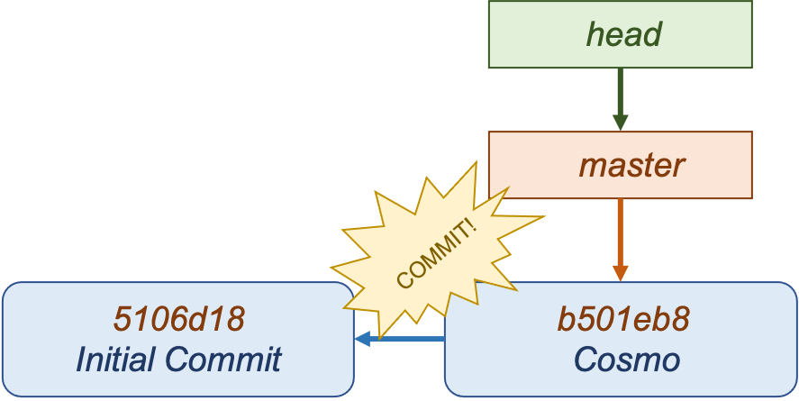

### Create a Branch

You can use the command `git branch` to create a new branch, which will point to your latest commit. To switch to this new branch, use `git checkout [branch]`. Note that head now points to the new branch.

```shell
$ git branch bronco

$ git branch
  bronco
* master

$ git checkout bronco
$ git branch
* bronco
  master
```

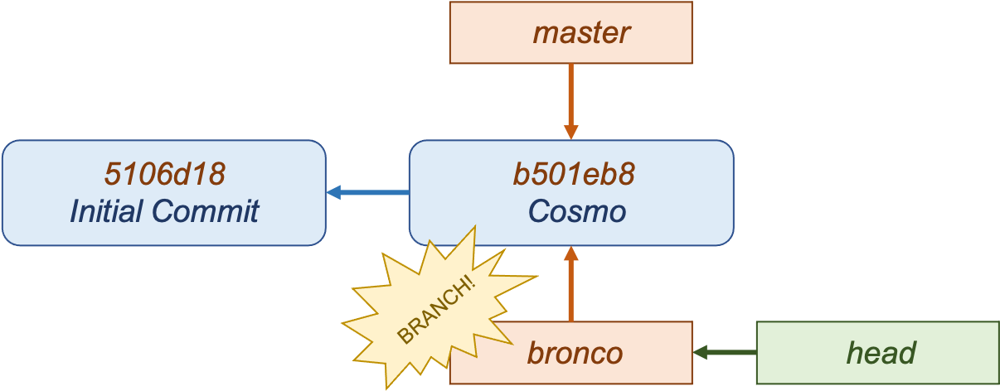

Committing to non-master branches is exactly the same process. However, the new bronco branch will keep track of the new changes whereas the master branch no longer tracks the changes.

You can switch back to the master branch and start a new line of commits that would be separate from bronco. You'd end up with something looking like this:

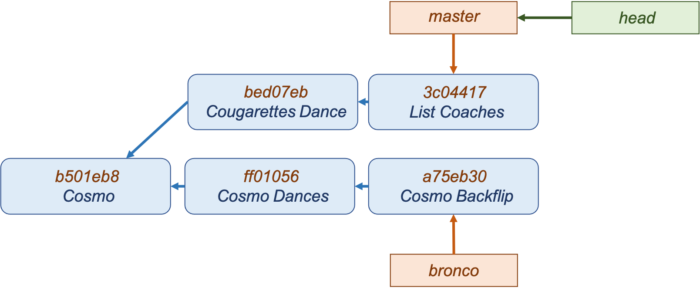

### Basic Merging

After creating branches and making changes, you may find yourself wanting to merge the branches back together. This is commonly done when work in a topic-specific branch is completed and ready to be merged back into the original branch. To do so, you use the command `git merge [branch]`.

In the scenario above, the merge will be a "three-way merge" (as opposed to fast-forward, which isn't discussed here). The process looks like this: first, Git determines the common ancestor of the two branches, in this case it's `b501eb8`. Then, Git applies the changes in each branches' current commit to the common ancestor. A new merge commit is created in the current branch.

```shell
$ git merge bronco
Merge made by the 'recursive strategy.
 Cosmo Backflip | 1 +
 List Coaches   | 1 +
 2 files changes, 2 insertions(+)
 create mode 100644 Cosmo Backflip
 create mode 100644 List Coaches
```

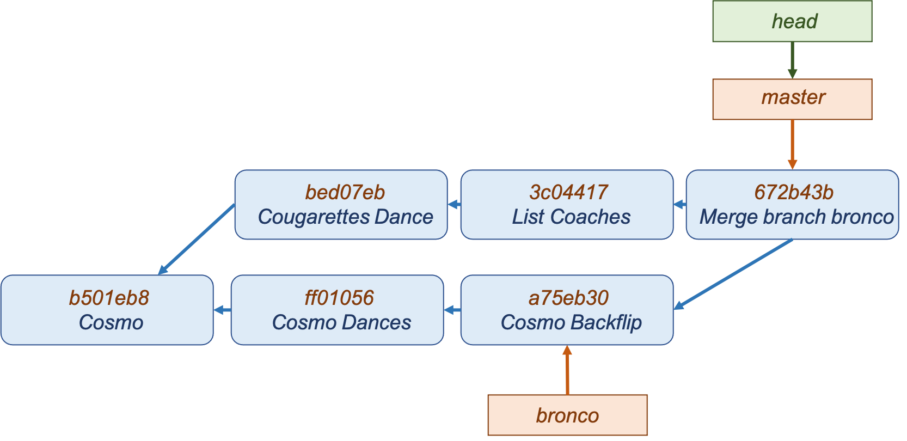

Once the merge is complete, you may find yourself wanting to delete the old branch as it's no longer needed. This can easily be done with the command `git branch -d [branch name]`.

### Merge Conflicts

What happens when there are conflicting changes in a merge? For example, let's say we're merging two files called `players.txt`:

```
master players.txt      bronco players.txt
0 Cosmo the Cougar      0 Cosmo
4 Taysom Hill           4 Taysom Hill
10 Mitch Mathews        10 Mitch Mathews
12 Tanner Mangum        12 Tanner Mangum 
```

Here, there is a conflict between Cosmo and Cosmo the Cougar. Instead of merging, the user(s) must manually resolve the conflict and recommit:

```shell
$ git merge bronco
Auto-merging players.txt
CONFLICT (content): Merge conflict in players.txt
Automatic merge failed: fix conflicts and then commit the result.
```

```
players.txt
<<<<<< HEAD
0 Cosmo the Cougar
=======
0 Cosmo
>>>>>> bronco
4 Taysom Hill
10 Mitch Mathews
12 Tanner Mangum
```

The file's current state will resemble the `players.txt` file here. It will contain the content of both branches, and leave it to the user to determine what should stay or go. The "less-than", "equals", and "greater-than" lines are conveniences added to help determine where the lines originated from. 

You will need to update the conflicting file by hand, re-add it to the staging area, then run `git commit` again to complete the merge process.

### Rebasing

Rebasing is another way to combine changes from two branches, and has its own uses in combining branches. Unlike a merge, a rebase will change the history of a project (and leave it cleaner). 

To do so, you first check out the branch that will be rebased onto another branch. When you run rebase, any changes made in that branch will be replayed onto the target branch, creating a new commit. Unlike merging, rebase will rewrite history. The history of the bronco branch has been rewritten so that the master branch is its parent. 

At this point, the target branch can be checked out and merged, which fast-forwards it to the same commit as the bronco branch. In the end, this resulting commit is the same as if a three-way merge was performed–but the rebase provides a re-written, simpler history.

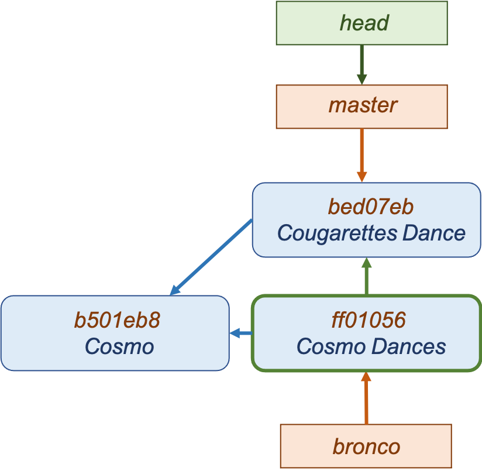

```shell
$ git checkout bronco
$ git rebase master
First, rewinding head to replay your work on top of it...
Applying: Add Cosmo Dances
$ git checkout master
Switched to branch 'master'
$ git merge bronco
Updating b8d07eb..c1ff945
Fast-forward
  Cosmo Dance | 2 +-
  1 file changed, 1 insertion(+), 1 deletion(-)
```

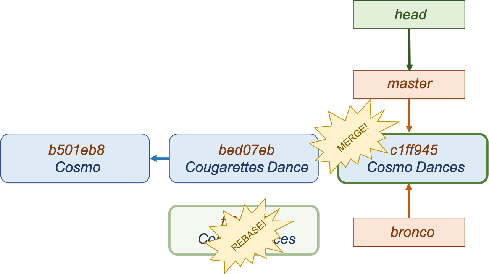

Rebasing makes your history cleaner, but does so by rewriting it. As such, it's usually a bad idea to rebase commits that exist outside of a personal repository.

### Tags

A tag is just a non-moving pointer to a particular commit. It's often used to tag specific releases.

```shell
$ git tag v1.0 3c04417
$ git log --oneline --decorate
672b43b (Head, master) Merge branch 'bronco'
3c04417 (tag: v1.0) Recruit Players
```

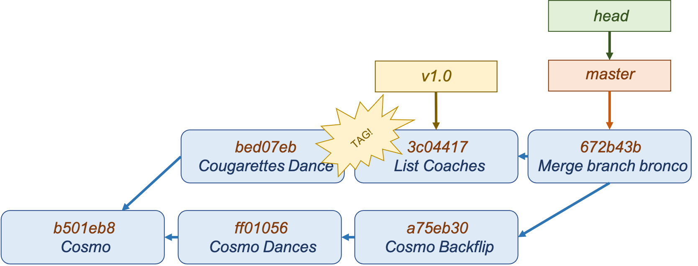


## GitHub

Today, a major component of using git is making use of remote git repositories on the internet. A remote git repo can be cloned into a local repo. Local repo changes can be pushed to remote repos. Remote repo changes can be pulled to the local repo. That leads us to the foremost provider of git repository hosting: GitHub. GitHub provides management features and access control that aren't provided by git itself.

### Cloning Repos

Here is an example of cloning the official git repo of Julia language's source code:

```shell
$ ls -l

$ git clone git://github.com/JuliaLang/julia
Cloning into 'julia'...
remote: Counting objects: 163187, done.
remote: Compressing objects: 100% (43/43), done.
remote: Total 163187 (delta 23), reused 8 (delta 8), pack-reused 163136
Receiving objects: 100% (163187/163187), 91.95 MiB | 8.81 MiB/s, done.
Resolving deltas: 100% (124274/124274), done.
Checking connectivity... done.

$ ls -l
drwxrwxr-x 12 cosmo cosmo 4096 Dec 21 16:24 julia
```

When a repo is cloned, the remote repo (and its URL) are automatically saved under the default name of 'origin'.

```shell
$ cd julia

$ git remote show
origin                 # The default name of a cloned remote is 'origin'

$ git remote -v
origin   git://github.com/Julialang/julia (fetch)   # Git stores a URL with
origin   git://github.com/JuliaLang/julia (push)    # the short name (origin)
```

There is nothing special about the origin. Other remote repos can be associated with the local repo as well. It turns out that tkelman and vtjnash are two Julia developers that have their own Julia language repos. They do their personal work in these repos before pushing it to the official Julia repo. We can add their remote repos and potentially view or pull in their local work–work that isn't necessarily in the official repo (yet). We gave the remote repos easy-to-type aliases of "tony" and "jameson"

```shell
$ git remote add tony git://github.com/tkelman/julia
$ git remote add jameson git://github.com/vtjnash/julia

$ git remote -v

jameson   git://github.com/vtjnash/julia (fetch)
jameson   git://github.com/vtjnash/julia (push)
origin    git://github.com/JuliaLang/julia (fetch)
origin    git://github.com/JuliaLang/julia (push)
tony      git://github.com/tkelman/julia (fetch)
tony      git://github.com/tkelman/julia (push)
```

### Fetching from Remotes

Here is an example of pulling work from Tony's repo. These are code changes that he has done locally and may not be in the official Julia repo.

```shell
$ git fetch tony
remote: Counting objects: 6521, done.
remote: total 6521 (delta 3108), reused 3108 (delta 3108), pack-reused 3413
Receiving objects: 100% (6521/6521), 1.66 MiB | 2.42 MiB/s, done.
Resolving deltas: 100% (4358/4358), completed with 654 local objects.
From git://github.com/tkelman/julia
 * [new branch]     12870              -> tony/12879
 * [new branch]     64to32cross        -> tony/64to32cross
 * [new branch]     9376-wip1          -> tony/9376-wip1
 * [new branch]     anj/arraydiv       -> tony/anj/arraydiv
 * [new branch]     anj/eig            -> tony/anj/eig
 * [new branch]     anj/matmul         -> tony/anj/matmul
 * [new branch]     anj/noncommutative -> tony/anj/noncommutative
```

### Pushing to Remotes

Local changes can be pushed to remote repos. Branches were discussed previously. This example shows an example of pushing the local branch to a remote master branch. How that push is handled depends on the remote repo. For example, public projects often have access controls which restrict who can push changes to master. In such cases, open a "Pull request" in which you ask a maintainer to review your changes and pull them into master.

```shell
git push origin master
```
