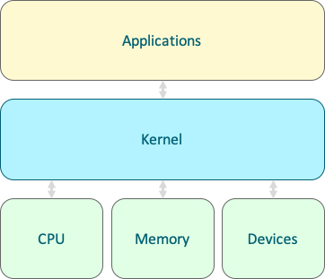

---
---

# Intro to Linux

## Operating Systems

Microsoft Windows, Mac OS, and GNU/Linux are all operating systems (OS). The heart of an OS is the kernel. The kernel manages access to the hardware and also provides ways for applications to talk to each other. The operating system usually provides software like a desktop interface, a text editor (and other textual or graphical user interfaces), and software for using storage devices.

Linux is a kernel. GNU refers to a collection of additional tools. In general conversation, though, when we say someone uses Linux, we refer to both the OS and its suite of fundamental software components. There are many flavors, or distributions, of Linux. These all have a common suite of tools, but there are some distinct differences and goals from one distro to another.

For the purposes of this class, when we say "Linux" we're referring to the kernel and the operating system around it, comparable to what people mean by Windows or MacOS.

## Using Linux on the Supercomputer

A Linux shell is a text-based interface that provides simple tools. It can be quite powerful when these tools are chained. Throughout this course, you will need to connect to the supercomputer to complete exercises and assignments. To access a Linux shell on the supercomputer, [create an account](https://rc.byu.edu/account/create/) then:

<iframe width="560" height="315" src="https://www.youtube-nocookie.com/embed/6MfnAlQiUcw?si=BLEECI9den04pQMw" title="YouTube video player" frameborder="0" allow="accelerometer; autoplay; clipboard-write; encrypted-media; gyroscope; picture-in-picture; web-share" allowfullscreen></iframe>

In short, open a terminal/command prompt and run `ssh [netid]@ssh.rc.byu.edu`.

To avoid needing to enter your credentials for every shell, consider setting up [SSH multiplexing](https://rc.byu.edu/wiki/?id=SSH+Multiplexing).