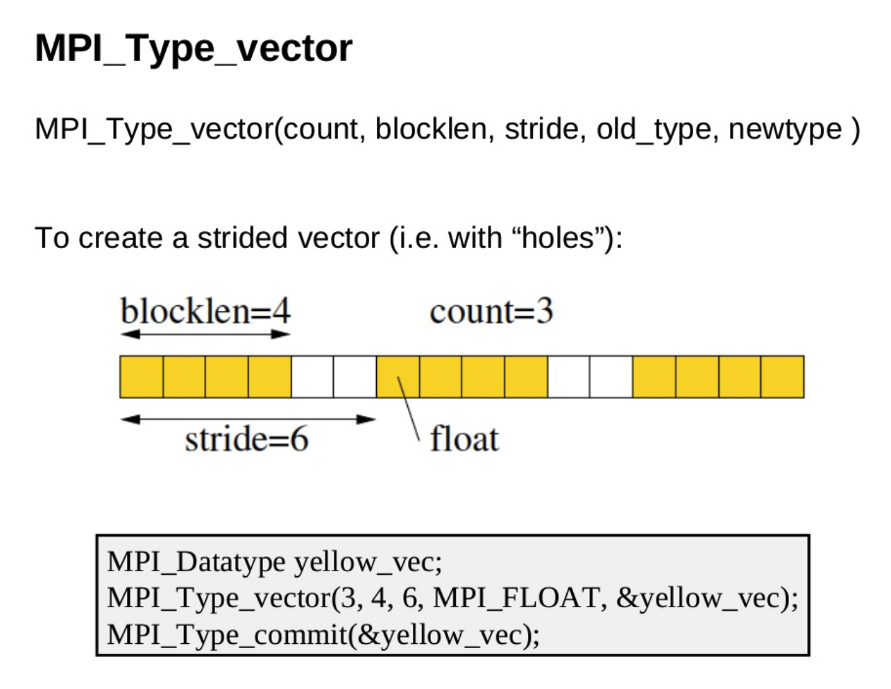

---
---

# Distributed Programming and MPI


## Distributed Programming

Read [subsections 2.6.3.1-6](EijkhoutHPCTutorialsVol1.pdf#subsection.2.6.3) of Eijkhout's *Science of Computing*.


## MPI

The [Message Passing Interface (MPI)](https://en.wikipedia.org/wiki/Message_Passing_Interface) is an interface for passing data between processes using messages. It allows for **distributed memory** programming, unlike OpenMP or C++ threads which require **shared memory**; this means that an MPI program can span multiple nodes. These processes can be on the same machine or across nodes. All MPI programs begin with a call to `MPI_Init` and end with `MPI_Finalize`. The MPI functions are defined in `mpi.h`.

```c++
#include <iostream>
#include <mpi.h>

int main(int argc, char * argv []) {
    MPI_Init(&argc, &argv);
    std::cout << "Hello, World" << std::endl;
    MPI_Finalize();
    return 0;
}
```

### Compilation

With most MPI compilers, you can use `mpic++` in the place of a C++ compiler like `g++` to compile MPI C++ code:

```shell
mpicxx -std=c++20 -o myprog myprog.cpp
```

The partial `CMakeLists.txt` below will build an MPI program only if the MPI compiler for C++ is found; this allows building the other executables even if MPI isn't available. 

```cmake
cmake_minimum_required(VERSION 3.9)
find_package(MPI)
if(MPI_CXX_FOUND)
    add_executable(hello hello.cc)
    target_link_libraries(hello PRIVATE MPI::MPI_CXX)
endif()
```

Read [chapter 1](EijkhoutHPCTutorialsVol2.pdf#chapter.1) and [sections 2.3-2.5](EijkhoutHPCTutorialsVol2.pdf#section.2.3) Eijkhout's *Parallel Programming*.

### Finding Documentation

There is enough breadth to MPI that we couldn't cover it all even if we dedicated the entire semester to doing so, which means that knowing how to find documentation on what we don't explicitly cover is vital--being able to quickly look up a function that we mention in a video can help you understand it better, and using a different approach than the [example code](https://github.com/BYUHPC/sci-comp-course-example-cxx/blob/main/src/MountainRangeMPI.hpp) might take you into territory that we haven't talked about.

As is often the case, the `man` pages are a good place to start. Once you have a compiler and MPI module loaded (e.g. `gcc/13` and `openmpi/4.1`), you can run `man 3 MPI_Function_name` to get the details on that function. For example, to find out more about `MPI_Allreduce`, you could use `module load gcc/latest openmpi; man 3 MPI_Allreduce`. You can also take advantage of your shell's tab completion to get a full listing of all available MPI functions by typing `man 3 MPI_` then pressing the tab key.

[Online documentation](https://www.open-mpi.org/doc/current/) is also available but generally contains no more information than do the `man` pages. [Microsoft's online MPI documentation](https://docs.microsoft.com/en-us/message-passing-interface/mpi-reference) is reasonably well organized and concise (partly because it doesn't include Fortran information), although it is possible that there are subtle differences between it and OpenMPI, MVAPICH, etc. When you know a function name or have an idea of what it might be called, `man` pages and online documentation should be the first place you turn.

Not knowing the name of the function that you are looking for, though, renders said documentation a vast sea of (often poorly organized) information in which you need to find a small drop of truth. As you get more familiar with MPI, you'll be able to find a handful of functions that look right and see which one is suited for what you want to do, but until then the best way to quickly find what you're looking for is usually to search something along the lines of "How to ____ with MPI" and try to pick a recent, relevant result. If that fails, reach out to us and we'll try to point you the right way.


## MPI I/O

The MPI data types which describe the memory layout of messages are reused to describe the file layout on persistent storage.

File are opened with `MPI_File_open` and closed with `MPI_File_close`. There are various "modes" for opening files. This example opens the file in read-only mode. If it doesn't exist, `MPI_File_open` will return an [error](https://www.mcs.anl.gov/research/projects/mpi/mpi-standard/mpi-report-1.1/node148.htm).

```c++
MPI_File handle;
MPI_File_open(MPI_COMM_WORLD, "workfile", MPI_MODE_RDONLY, MPI_INFO_NULL, &handle);

// do file operations, then:
MPI_File_close(&handle);
```

### Error Handling

In C, every MPI function will return an error code. It is tedious to handle every MPI function call with an if-condition. MPI allows registering a function for error handling and provides a standard `MPI_ERRORS_ARE_FATAL` function that will call `MPI_Abort`.

The `MPI_File_*` routines use a separate error handler from the communicators. If you aren't going to print any diagnostic information or do anything else useful, then we recommend using the error handler to keep your code clean.

### Collective Operations

File operations can either be done individually or as a collective. Generally, the collective operations will yield better performance unless the amount of data read is small, or if the decomposition is unnatural. This is one of the major advantages of MPI IO over serial IO.

|                | Writing                 | Reading                |
| -------------- | ----------------------- | ---------------------- |
| **Individual** | `MPI_File_write`        | `MPI_File_read`        |
| **Individual** | `MPI_File_write_at`     | `MPI_File_read_at`     |
| **Collective** | `MPI_File_write_all`    | `MPI_File_read_all`    |
| **Collective** | `MPI_File_write_at_all` | `MPI_File_read_at_all` |

To read a single integer from the beginning of the file `mydata.dat` then read that many integers from the same file, distributing them roughly evenly among processes, one might use:

```c++
// Determine global size and this process's rank
int mpi_rank, mpi_size;
MPI_Comm_rank(MPI_COMM_WORLD, &mpi_rank);
MPI_Comm_size(MPI_COMM_WORLD, &mpi_size);

// Open file
MPI_File f;
MPI_File_open(MPI_COMM_WORLD, "mydata.dat", MPI_MODE_RDONLY, MPI_INFO_NULL, &f);

// Read header
int n;
auto header_size = sizeof(n);
MPI_File_read_all(f, &n, 1, MPI_INT, MPI_STATUS_IGNORE);

// Read body
int local_n = n / mpi_size;
int local_offset = mpi_rank * local_n;
if (mpi_rank == mpi_size-1) local_n += n % mpi_size; // last proc gets remainder
std::vector<int> v(local_n);
MPI_File_read_at(f, header_size+local_offset, v.data(), v.size(), MPI_INT, MPI_STATUS_IGNORE);
```

### File Layout

It is common for files to have a "header" which has information that each process will need. Then there will be a section of data that gets partitioned so that each process is responsible for only that partition.

It's best if this layout is process-agnostic, meaning it does not assume the number of MPI processes that will work on it.

As an example, the wave orthotope's format includes a header with a dimension, a size, a damping coefficient, and a time. Each process will need this data. A grid follows, which will be sliced up into evenly sized chunks and distributed between processes.


## Appendix A: MPI Custom Data Types

You don't need the information below, as it's a bit overwrought for a simple [problem like the project](../project/overview.md), but some people might find this paradigm easier to reason through.

Custom MPI datatypes are often built to describe the format in a more natural, higher-level view. After defining a custom data-type, a call to `MPI_Type_commit` must be issued before using the new datatype. A call to `MPI_Type_free` should be issued when you are done with the type, which is usually just before `MPI_Finalize`.

### `MPI_Type_contiguous`

Create a new type that represents an array of a known type as a single type:

```c++
MPI_Datatype Quad;
MPI_Type_contiguous(4, MPI_INT, &Quad);
MPI_Type_commit(&Quad);

std::array<int, 4> data{1, 3, 5, 7};
MPI_Send(&data[0], 1, Quad, dest, tag, comm);

// when finished with the type
MPI_Type_free(&Quad);
```

### `MPI_Type_create_struct`

Create a new type that is possibly heterogeneous and unevenly spaced (like a struct in C++):

```c++
struct Meta {
  uint32_t iterations;
  float epsilon;
};
```

Dealing with structs is more complicated because they can have different types and offsets. 

First, let's define a struct composed of heterogeneous types.

```c++
int sizes[]{1, 1};
MPI_datatype types[]{MPI_UINT32_T, MPI_FLOAT};
MPI_Aint offsets[]{offsetof(Meta, iterations),
                   offsetof(Meta, epsilon)};

static_assert(std::size(sizes) == std::size(types) &&
              std::size(sizes) == std::size(offsets),
              "Arrays must be of same length.");

MPI_Datatype MPI_Meta;
MPI_Type_create_struct(std::size(sizes), sizes, offsets, types, &MPI_Meta);
```

Now, we have to describe that same struct to MPI. `static_assert` is a function that runs at compile time (when the compiler is compiling our code, not when the program is run). In this case, we are using it to make sure we didn't accidentally make our three arrays "sizes", "types", and "offsets" of different sizes.

```c++
Meta meta;
if (rank == 0) {
  meta.iterations = 10;
  meta.epsilon = 0.1f;
}

int root = 0; // root has the data to be broadcast
MPI_Bcast(&meta, 1, MPI_meta, root, MPI_COMM_WORLD);
```

`root` here is the 0th process. You can get a few more details on `MPI_Bcast` from [here](https://mpitutorial.com/tutorials/mpi-broadcast-and-collective-communication/#broadcasting-with-mpi_bcast).

### `MPI_Type_vector`

Like `MPI_Type_contiguous`, but has evenly spaced holes. This is useful when working with **halos** (or **ghost cells**). Sometimes when splitting an array across processes, the cells at the edge of each process's piece of the array need to be shared with neighbor processes; these cells are halos.

```c++
MPI_Type_vector(int count, int blocklength,
                int stride, MPI_Datatype oldtype,
                MPI_Datatype *newtype)
```

These three calls describe equivalent data types:

```c++
MPI_Type_contiguous(count, oldtype, &newtype)
MPI_Type_vector(count, 1, 1, oldtype, &newtype)
MPI_Type_vector(1, count, count, oldtype, &newtype)
```

Using an MPI_Type_vector that is contiguous like this is rarely useful, but helps to create an understanding of what is going on. The real value comes from adding "holes":



Note that `stride` is at least `blocklen`. A common mistake is to use `stride` for the space between the first block and beginning of the second, which is wrong--it's the number of elements between the beginning of one block and the beginning of the next block.

### Multidimensional Arrays

Multidimensional arrays are common enough that there is a function dedicated to creating them: `MPI_Type_create_subarray`. Reading and writing multidimensional arrays is the same, except you replace read with write and make sure the file has been opened for writing. The examples below will focus on reading. 

It requires you to define the global array and then which piece of it the current process should "own". This makes reading/writing the entire array from/to a file using collective operations easier. Supposedly, all processes need to have the same sizes; it's not in the documentation, but we have seen more than one person say so, and empirically we've seen errors when this isn't the case.

```c++
MPI_Datatype newType;
MPI_Type_create_subarray(/*...*/, MPI_INT, &newType);
MPI_Type_commit(&newType);

MPI_File_set_view(fh, 0, MPI_FLOAT, newType, "native",
                  MPI_INFO_NULL);

int count = /* # items of this rank has, not global # */;
MPI_File_read_all(fh, &data, count, MPI_INT, MPI_STATUS_IGNORE);
// make sure 'data' can hold 'count' items!

MPI_Type_free(&newType);
```

It seems odd that we set the view to some higher-level type and then do the read on the lower-level; this allows the program to read the data into a non-contiguous buffer.

The `0` in `MPI_File_set_view` is the displacement from the existing view; there is often a header before the array, so its size would usually be put in the `0`'s place.

```c++
int ndims = 2;
const int sizes[]{6, 4};    // global size
const int subsizes[]{?, ?}; // how much each rank has
const int starts[]{?, ?};   // where this rank starts
int order = MPI_ORDER_C;
MPI_Datatype oldtype = MPI_INT;
MPI_Datatype newType;

MPI_Type_create_subarray(ndims, sizes, subsizes, starts,
                         order, oldtype, &newType);
```

Let's say we have a 6 row, 4 column grid and 2 ranks. Let's split it up using row-based decomposition.

- What values should we insert for subsizes in place of those question marks? All processes should have the same subsizes. In this case, using row partitioning, we should end up with `{6/2, 4}`.
- What values should we insert in starts in place of those question marks? each process should specify where it starts in each dimension. As one possibility:
    - Rank 0 starts at `{0, 0}`
    - Rank 1 starts at `{3, 0}`
- Why do they have 0 for columns? We aren't partitioning based on columns, only rows. It's possible to partition every dimension.

```c++
MPI_Type_create_subarray(/*...*/);
MPI_Type_commit(&newType);

MPI_File_set_view(fh, 0, MPI_INT, newType, "native",
                  MPI_INFO_NULL);

int count = subsizes[0] * subsizes[1];
MPI_File_read_all(fh, &data, count, MPI_INT,
                  MPI_STATUS_IGNORE);

MPI_Type_free(&newType);
```

Later on when we actually do the read call, we tell it to use the subsize information we calculated earlier.
