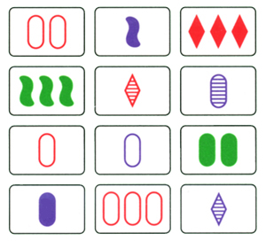

---
---

# Pattern Matching


## Regex



If any of you have played the card game of Set, then you will know that it is a pattern-matching game based on some basic rules. The rules for matching three cards are:

1. The color on the three cards must always or never match.
1. The number of shapes must always or never match.
1. The fill of the shape must always or never match.
1. The type of shape must always or never match. 

Based on these rules, how many sets can you find in these 12 cards? People are able to internalize the rules to solve this pattern-matching problem. How can a computer perform a similar process?

**Regular expressions (regex)** give you a way to define your own matching rules for text. Regex is a powerful tool that lets you define exactly how you want to search and match subsets of text. If you've used a basic "find" feature in your word processor or browser, then you have a basic idea of the purpose of regular expressions, except rather than finding specific phrases, you define patterns.

There are several practical applications of Regex:

- Filter spam
- Search large texts
- Detect computer virus signatures
- Find patterns in DNA sequences
- Validate input on a website form
- Search-and-replace in a word processor

But why is it useful in supercomputing? Scientific computing workflows usually involve huge amounts of data. Regular expressions can be used to:

- Filter out irrelevant data
- Locate relevant data
- Detect errors in data

Regex examples can be very brief:

```shell
^\S+@\S+$ # matches an email address if it's just an '@' surrounded by non-whitespace
```

...or not:

<details><summary>The real email regex</summary>
<code>
(?:(?:\r\n)?[ \t])*(?:(?:(?:[^()<>@,;:\\".\[\] \000-\031]+(?:(?:(?:\r\n)?[ \t])+|\Z|(?=[\["()<>@,;:\\".\[\]]))|"(?:[^\"\r\\]|\\.|(?:(?:\r\n)?[ \t]))*"(?:(?:\r\n)?[ \t])*)(?:\.(?:(?:\r\n)?[ \t])*(?:[^()<>@,;:\\".\[\] \000-\031]+(?:(?:(?:\r\n)?[ \t])+|\Z|(?=[\["()<>@,;:\\".\[\]]))|"(?:[^\"\r\\]|\\.|(?:(?:\r\n)?[ \t]))*"(?:(?:\r\n)?[ \t])*))*@(?:(?:\r\n)?[ \t])*(?:[^()<>@,;:\\".\[\] \000-\031]+(?:(?:(?:\r\n)?[ \t])+|\Z|(?=[\["()<>@,;:\\".\[\]]))|\[([^\[\]\r\\]|\\.)*\](?:(?:\r\n)?[ \t])*)(?:\.(?:(?:\r\n)?[ \t])*(?:[^()<>@,;:\\".\[\] \000-\031]+(?:(?:(?:\r\n)?[ \t])+|\Z|(?=[\["()<>@,;:\\".\[\]]))|\[([^\[\]\r\\]|\\.)*\](?:(?:\r\n)?[ \t])*))*|(?:[^()<>@,;:\\".\[\] \000-\031]+(?:(?:(?:\r\n)?[ \t])+|\Z|(?=[\["()<>@,;:\\".\[\]]))|"(?:[^\"\r\\]|\\.|(?:(?:\r\n)?[ \t]))*"(?:(?:\r\n)?[ \t])*)*\<(?:(?:\r\n)?[ \t])*(?:@(?:[^()<>@,;:\\".\[\] \000-\031]+(?:(?:(?:\r\n)?[ \t])+|\Z|(?=[\["()<>@,;:\\".\[\]]))|\[([^\[\]\r\\]|\\.)*\](?:(?:\r\n)?[ \t])*)(?:\.(?:(?:\r\n)?[ \t])*(?:[^()<>@,;:\\".\[\] \000-\031]+(?:(?:(?:\r\n)?[ \t])+|\Z|(?=[\["()<>@,;:\\".\[\]]))|\[([^\[\]\r\\]|\\.)*\](?:(?:\r\n)?[ \t])*))*(?:,@(?:(?:\r\n)?[ \t])*(?:[^()<>@,;:\\".\[\] \000-\031]+(?:(?:(?:\r\n)?[ \t])+|\Z|(?=[\["()<>@,;:\\".\[\]]))|\[([^\[\]\r\\]|\\.)*\](?:(?:\r\n)?[ \t])*)(?:\.(?:(?:\r\n)?[ \t])*(?:[^()<>@,;:\\".\[\] \000-\031]+(?:(?:(?:\r\n)?[ \t])+|\Z|(?=[\["()<>@,;:\\".\[\]]))|\[([^\[\]\r\\]|\\.)*\](?:(?:\r\n)?[ \t])*))*)*:(?:(?:\r\n)?[ \t])*)?(?:[^()<>@,;:\\".\[\] \000-\031]+(?:(?:(?:\r\n)?[ \t])+|\Z|(?=[\["()<>@,;:\\".\[\]]))|"(?:[^\"\r\\]|\\.|(?:(?:\r\n)?[ \t]))*"(?:(?:\r\n)?[ \t])*)(?:\.(?:(?:\r\n)?[ \t])*(?:[^()<>@,;:\\".\[\] \000-\031]+(?:(?:(?:\r\n)?[ \t])+|\Z|(?=[\["()<>@,;:\\".\[\]]))|"(?:[^\"\r\\]|\\.|(?:(?:\r\n)?[ \t]))*"(?:(?:\r\n)?[ \t])*))*@(?:(?:\r\n)?[ \t])*(?:[^()<>@,;:\\".\[\] \000-\031]+(?:(?:(?:\r\n)?[ \t])+|\Z|(?=[\["()<>@,;:\\".\[\]]))|\[([^\[\]\r\\]|\\.)*\](?:(?:\r\n)?[ \t])*)(?:\.(?:(?:\r\n)?[ \t])*(?:[^()<>@,;:\\".\[\] \000-\031]+(?:(?:(?:\r\n)?[ \t])+|\Z|(?=[\["()<>@,;:\\".\[\]]))|\[([^\[\]\r\\]|\\.)*\](?:(?:\r\n)?[ \t])*))*\>(?:(?:\r\n)?[ \t])*)|(?:[^()<>@,;:\\".\[\] \000-\031]+(?:(?:(?:\r\n)?[ \t])+|\Z|(?=[\["()<>@,;:\\".\[\]]))|"(?:[^\"\r\\]|\\.|(?:(?:\r\n)?[ \t]))*"(?:(?:\r\n)?[ \t])*)*:(?:(?:\r\n)?[ \t])*(?:(?:(?:[^()<>@,;:\\".\[\] \000-\031]+(?:(?:(?:\r\n)?[ \t])+|\Z|(?=[\["()<>@,;:\\".\[\]]))|"(?:[^\"\r\\]|\\.|(?:(?:\r\n)?[ \t]))*"(?:(?:\r\n)?[ \t])*)(?:\.(?:(?:\r\n)?[ \t])*(?:[^()<>@,;:\\".\[\] \000-\031]+(?:(?:(?:\r\n)?[ \t])+|\Z|(?=[\["()<>@,;:\\".\[\]]))|"(?:[^\"\r\\]|\\.|(?:(?:\r\n)?[ \t]))*"(?:(?:\r\n)?[ \t])*))*@(?:(?:\r\n)?[ \t])*(?:[^()<>@,;:\\".\[\] \000-\031]+(?:(?:(?:\r\n)?[ \t])+|\Z|(?=[\["()<>@,;:\\".\[\]]))|\[([^\[\]\r\\]|\\.)*\](?:(?:\r\n)?[ \t])*)(?:\.(?:(?:\r\n)?[ \t])*(?:[^()<>@,;:\\".\[\] \000-\031]+(?:(?:(?:\r\n)?[ \t])+|\Z|(?=[\["()<>@,;:\\".\[\]]))|\[([^\[\]\r\\]|\\.)*\](?:(?:\r\n)?[ \t])*))*|(?:[^()<>@,;:\\".\[\] \000-\031]+(?:(?:(?:\r\n)?[ \t])+|\Z|(?=[\["()<>@,;:\\".\[\]]))|"(?:[^\"\r\\]|\\.|(?:(?:\r\n)?[ \t]))*"(?:(?:\r\n)?[ \t])*)*\<(?:(?:\r\n)?[ \t])*(?:@(?:[^()<>@,;:\\".\[\] \000-\031]+(?:(?:(?:\r\n)?[ \t])+|\Z|(?=[\["()<>@,;:\\".\[\]]))|\[([^\[\]\r\\]|\\.)*\](?:(?:\r\n)?[ \t])*)(?:\.(?:(?:\r\n)?[ \t])*(?:[^()<>@,;:\\".\[\] \000-\031]+(?:(?:(?:\r\n)?[ \t])+|\Z|(?=[\["()<>@,;:\\".\[\]]))|\[([^\[\]\r\\]|\\.)*\](?:(?:\r\n)?[ \t])*))*(?:,@(?:(?:\r\n)?[ \t])*(?:[^()<>@,;:\\".\[\] \000-\031]+(?:(?:(?:\r\n)?[ \t])+|\Z|(?=[\["()<>@,;:\\".\[\]]))|\[([^\[\]\r\\]|\\.)*\](?:(?:\r\n)?[ \t])*)(?:\.(?:(?:\r\n)?[ \t])*(?:[^()<>@,;:\\".\[\] \000-\031]+(?:(?:(?:\r\n)?[ \t])+|\Z|(?=[\["()<>@,;:\\".\[\]]))|\[([^\[\]\r\\]|\\.)*\](?:(?:\r\n)?[ \t])*))*)*:(?:(?:\r\n)?[ \t])*)?(?:[^()<>@,;:\\".\[\] \000-\031]+(?:(?:(?:\r\n)?[ \t])+|\Z|(?=[\["()<>@,;:\\".\[\]]))|"(?:[^\"\r\\]|\\.|(?:(?:\r\n)?[ \t]))*"(?:(?:\r\n)?[ \t])*)(?:\.(?:(?:\r\n)?[ \t])*(?:[^()<>@,;:\\".\[\] \000-\031]+(?:(?:(?:\r\n)?[ \t])+|\Z|(?=[\["()<>@,;:\\".\[\]]))|"(?:[^\"\r\\]|\\.|(?:(?:\r\n)?[ \t]))*"(?:(?:\r\n)?[ \t])*))*@(?:(?:\r\n)?[ \t])*(?:[^()<>@,;:\\".\[\] \000-\031]+(?:(?:(?:\r\n)?[ \t])+|\Z|(?=[\["()<>@,;:\\".\[\]]))|\[([^\[\]\r\\]|\\.)*\](?:(?:\r\n)?[ \t])*)(?:\.(?:(?:\r\n)?[ \t])*(?:[^()<>@,;:\\".\[\] \000-\031]+(?:(?:(?:\r\n)?[ \t])+|\Z|(?=[\["()<>@,;:\\".\[\]]))|\[([^\[\]\r\\]|\\.)*\](?:(?:\r\n)?[ \t])*))*\>(?:(?:\r\n)?[ \t])*)(?:,\s*(?:(?:[^()<>@,;:\\".\[\] \000-\031]+(?:(?:(?:\r\n)?[ \t])+|\Z|(?=[\["()<>@,;:\\".\[\]]))|"(?:[^\"\r\\]|\\.|(?:(?:\r\n)?[ \t]))*"(?:(?:\r\n)?[ \t])*)(?:\.(?:(?:\r\n)?[ \t])*(?:[^()<>@,;:\\".\[\] \000-\031]+(?:(?:(?:\r\n)?[ \t])+|\Z|(?=[\["()<>@,;:\\".\[\]]))|"(?:[^\"\r\\]|\\.|(?:(?:\r\n)?[ \t]))*"(?:(?:\r\n)?[ \t])*))*@(?:(?:\r\n)?[ \t])*(?:[^()<>@,;:\\".\[\] \000-\031]+(?:(?:(?:\r\n)?[ \t])+|\Z|(?=[\["()<>@,;:\\".\[\]]))|\[([^\[\]\r\\]|\\.)*\](?:(?:\r\n)?[ \t])*)(?:\.(?:(?:\r\n)?[ \t])*(?:[^()<>@,;:\\".\[\] \000-\031]+(?:(?:(?:\r\n)?[ \t])+|\Z|(?=[\["()<>@,;:\\".\[\]]))|\[([^\[\]\r\\]|\\.)*\](?:(?:\r\n)?[ \t])*))*|(?:[^()<>@,;:\\".\[\] \000-\031]+(?:(?:(?:\r\n)?[ \t])+|\Z|(?=[\["()<>@,;:\\".\[\]]))|"(?:[^\"\r\\]|\\.|(?:(?:\r\n)?[ \t]))*"(?:(?:\r\n)?[ \t])*)*\<(?:(?:\r\n)?[ \t])*(?:@(?:[^()<>@,;:\\".\[\] \000-\031]+(?:(?:(?:\r\n)?[ \t])+|\Z|(?=[\["()<>@,;:\\".\[\]]))|\[([^\[\]\r\\]|\\.)*\](?:(?:\r\n)?[ \t])*)(?:\.(?:(?:\r\n)?[ \t])*(?:[^()<>@,;:\\".\[\] \000-\031]+(?:(?:(?:\r\n)?[ \t])+|\Z|(?=[\["()<>@,;:\\".\[\]]))|\[([^\[\]\r\\]|\\.)*\](?:(?:\r\n)?[ \t])*))*(?:,@(?:(?:\r\n)?[ \t])*(?:[^()<>@,;:\\".\[\] \000-\031]+(?:(?:(?:\r\n)?[ \t])+|\Z|(?=[\["()<>@,;:\\".\[\]]))|\[([^\[\]\r\\]|\\.)*\](?:(?:\r\n)?[ \t])*)(?:\.(?:(?:\r\n)?[ \t])*(?:[^()<>@,;:\\".\[\] \000-\031]+(?:(?:(?:\r\n)?[ \t])+|\Z|(?=[\["()<>@,;:\\".\[\]]))|\[([^\[\]\r\\]|\\.)*\](?:(?:\r\n)?[ \t])*))*)*:(?:(?:\r\n)?[ \t])*)?(?:[^()<>@,;:\\".\[\] \000-\031]+(?:(?:(?:\r\n)?[ \t])+|\Z|(?=[\["()<>@,;:\\".\[\]]))|"(?:[^\"\r\\]|\\.|(?:(?:\r\n)?[ \t]))*"(?:(?:\r\n)?[ \t])*)(?:\.(?:(?:\r\n)?[ \t])*(?:[^()<>@,;:\\".\[\] \000-\031]+(?:(?:(?:\r\n)?[ \t])+|\Z|(?=[\["()<>@,;:\\".\[\]]))|"(?:[^\"\r\\]|\\.|(?:(?:\r\n)?[ \t]))*"(?:(?:\r\n)?[ \t])*))*@(?:(?:\r\n)?[ \t])*(?:[^()<>@,;:\\".\[\] \000-\031]+(?:(?:(?:\r\n)?[ \t])+|\Z|(?=[\["()<>@,;:\\".\[\]]))|\[([^\[\]\r\\]|\\.)*\](?:(?:\r\n)?[ \t])*)(?:\.(?:(?:\r\n)?[ \t])*(?:[^()<>@,;:\\".\[\] \000-\031]+(?:(?:(?:\r\n)?[ \t])+|\Z|(?=[\["()<>@,;:\\".\[\]]))|\[([^\[\]\r\\]|\\.)*\](?:(?:\r\n)?[ \t])*))*\>(?:(?:\r\n)?[ \t])*))*)?;\s*)
</code>
</details>

Regex engines are common throughout command line tools, text editors, and programming languages. However, a given tool or programming language will implement a particular regex engine. Regex engines may differ slightly in syntax and supported features. It's important to learn the basics of regex, and to know how it's used in your specific context.

There are many regex engines; the most commonly used are:

- **Perl**: The gold standard for regular expressions
- **PCRE**: "Perl Compatible Regular Expressions" A C library inspired by Perl. Used by PHP, Julia, and R.
- **POSIX**: Used for common Linux commands such as `grep`. It comes in basic and extended flavors. One of the oldest and most limited regex engines still in use today.

If you're doing anything serious, you'll want something stronger than POSIX regex, although it's fine for very simple pattern matching.

[Regex Golf](https://alf.nu/RegexGolf) is a good place to practice with regular expressions.

### Examples

<iframe width="560" height="315" src="https://www.youtube-nocookie.com/embed/6d2yaXjLPkc?si=4Hz07JG1WS-sbJCh" title="YouTube video player" frameborder="0" allow="accelerometer; autoplay; clipboard-write; encrypted-media; gyroscope; picture-in-picture; web-share" allowfullscreen></iframe>

### Metacharacters

| Metacharacter | Meaning           | Example       | Would Match        | Wouldn't Match |
|---------------|-------------------|---------------|--------------------|----------------|
| `^`           | start of line     | `^persian`    | persian cat        | my persian cat |
| `$`           | end of line       | `persian$`    | he is persian      | is he persian? |
| `.`           | any one character | `ca.d`        | rock candy         | cared |
| `?`           | zero or one of    | `flavou?r`    | flavor, flavour    | flavouur |
| `+`           | one or more of    | `flavou+r`    | flavouuuur         | flavor |
| `*`           | zero or more of   | `flavou*r`    | flavor, flavouuur  | flavoor |
| `{x}`         | x of              | `fla{3}vor`   | flaaavor           | flaaaaavor |
| `{x,y}`       | x to y of         | `fla{2,4}vor` | flaavor, flaaaavor | flavor, flaaaaavor |
| `{x,}`        | x or more of      | `fla{2,}vor`  | flaavor, flaaaavor | flavor |
| `{,y}`        | up to y of        | `fla{,4}vor`  | flavor, flaaaavor  | flaaaaaaaavor |
| `|`           | alternation       | `cat|dog|bug` | cat, dog, bug      | caog |
| `[xyz]`       | any of x, y, z    | `^[0-9A-F]+$` | A048C1, 74F89A     | N4R9V3 |
| `[^xyz]`      | any but x, y, z   | `^[^aeiou]+$` | lynx, tsktsk       | links |
| `()`          | grouping          | `0x(00|FF)`   | 0x00, 0xFF         | 0x0F |
| `\`           | escape            | `x\{2\}`      | x{2}               | xx |

Shorthand:

| Class | Meaning      | Equivalent |
|-------|--------------|------------|
| `\w`  | A "word"     | `[A-Za-z0-9_]` |
| `\W`  | A "non-word" | `[^\w]` |
| `\s`  | A space      | `[\t\r\n\f]` |
| `\S`  | A non-space  | `[^\s]` |
| `\d`  | A digit      | `[0-9]` |
| `\D`  | A non-digit  | `[^\d]` |


## `grep`, `sed`, and `awk`

<iframe width="560" height="315" src="https://www.youtube-nocookie.com/embed/zUnTn2Xh2WM?si=EEQbBLsYilvYXxou" title="YouTube video player" frameborder="0" allow="accelerometer; autoplay; clipboard-write; encrypted-media; gyroscope; picture-in-picture; web-share" allowfullscreen></iframe>

`grep`, `sed`, and `awk` are discussed in more detail below. You don't need to know their functionality intimately, but you should be familiar with their basic usage and common use cases.


## `grep`

`grep` is the most commonly used pattern-matching tool on Linux. It's intended for basic single-line matches. Its default regex engine (POSIX Basic) is very limited. Users can invoke different flavors of regex to get the effect you want.

| How pattern is interpreted | `grep` command option |
|----------------------------|-----------------------|
| POSIX Basic (default)      | `grep`                |
| POSIX Extended             | `grep -E`             |
| Fixed Strings (no regex)   | `grep -F`             |
| Perl Regex (experimental)  | `grep -P`             |

In GNU grep (what you'll find on most Linux distros), there's no difference between `grep` and `grep -E`, although basic `grep` is less powerful on some systems.


## `sed`

The man page for sed calls it a "stream editor for filtering and transforming text". sed's main role is line-by-line editing of files and streams. The structure of a sed command is: `sed [flags] '[address] command' [file or text]`. Here is an example with the substitute command:

```shell
$ sed 's/hi/hello/' <<< 'hi, my name is John
                         I like hills
                         line with naught to replace'
hello, my name is John
I like hellolls
line with naught to replace
```

sed executes commands on each line of input by default. It can be used as a rudimentary language (it has [branching](https://www.gnu.org/software/sed/manual/html_node/Branching-and-flow-control.html)), but if you find yourself using it as more than a line-by-line editor, you should probably just use `awk`.

### Addresses

Check out the "Addresses" section of `sed`'s man page for a succinct and clear definition.

If only a command is given, it will be executed on every line. If you prefix that command with an address, you can limit its execution to those lines. There are several types of addresses. Below are examples that use the following file, `lines.txt`:

```
lines.txt:
this is line 1
now line 2
the 3rd line
line number 4
5th line here
This is the 6th line
```

`/regex/`: lines containing the regex

```shell
$ sed '/[Tt]his/ s/line/LINE/' lines.txt
this is LINE 1
now line 2
the 3rd line
line number 4
5th line here
This is the 6th LINE
```

`number`: the `number`th line

```shell
$ sed '4 s/line/LINE/' lines.txt
this is line 1
now line 2
the 3rd line
LINE number 4
5th line here
This is the 6th line
```

`n1,n2`: lines `n1` through `n2`

```shell
$ sed '3,5 s/line/LINE/' lines.txt
this is line 1
now line 2
the 3rd LINE
LINE number 4
5th LINE here
This is the 6th line
```

`first~step`: every `step`th line, starting at `first`

```shell
$ sed '2~3 s/line/LINE/' lines.txt
this is line 1
now LINE 2
the 3rd line
line number 4
5th LINE here
This is the 6th line
```

`$`: the last line

```shell
$ sed '$ s/line/LINE/' lines.txt
this is line 1
now line 2
the 3rd line
line number 4
5th line here
This is the 6th LINE
```

### `sed` Commands 

**Substitute** is probably the most used feature for `sed`. The examples above were all examples of substitute. The general syntax for using substitute is `s/old/new/`. This will replace the first instance of "old" with "new" on each line. 

```shell
$ echo "this is old, really old" | sed 's/old/new/'
this is new, really old
```

If you want to replace all instances, add `g` to the end without specifying an address:

```shell
$ echo "this is old, really old | sed 's/old/new/g'
this is new, really new
```

Say you want to replace a filepath--using `/` as separators in sed would be confusing. Fortunately, you can use other separators other than `/`. You can use pretty much any character, even letters and numbers. For example, commas: `sed 's,/file/path/before,/the/new/path,' myscript.sh` will replace the first occurrence of `/file/path/before` with `/the/new/path` on each line in `myscript.sh`.

You can also replace regexes with `sed`: `sed -E '/^Phone:/ s/[0-9]{7}/REDACTED/g' sensitive-info.txt`. You'll want the `-E` flag when using non-trivial regexes. However, this is a pretty weak phone number regex–as a thought exercise, what could be done to improve it?

`&` can be used to mean "the part of the line matching the pattern": 

```shell
$ echo 'this is a line' | sed 's/.*/LINE 1: &/'
LINE 1: this is a line
$ echo 'this is a line' | sed /s/line/LINE 1: &/'
this is a LINE 1: line
$ echo 'this is a line' | sed 's/.*/& (the first one)/'
this is a line (the first one)
```

`.*` in this context just means the whole line–any amount of any characters.

This is a useful feature if you want to do something like put quotes around a certain phrase:

```shell
$ sed 's/[Ss]mart|[Ll]ogic/"&"/g' i-am-very-smart.txt
I am quite "smart", so "smart" I got a 164 on a very reputable online IQ test
"Smart" is a way of life for me
Nobody really understands me because of my intellect
Only the truly enlightened believe me when I tell them that "logic" shows that the Earth is flat
```

It's also possible to match pieces of a pattern with \1, \2, etc.

```shell
$ echo "First: Pam,     Last: Beasley
        First: Dwight,  Last: Schrute
        First: Jim,     Last: Halpert" | \
  sed -E 's/\s*First: (.*),\s+Last: (.*)/\2, \1/'
Beasley, Pam
Schrute, Dwight
Halpert, Jim
```

Grouping is done with parentheses—enclose everything you want to use as a `\#` with parentheses. This also means if you want to use a literal parenthesis, you'll need to escape it with `\`.

The following commands reference `hex.txt`:

```
d6c2
75bf
cb21
84a7
```

The `i` command inserts a line above each applicable address:

```shell
$ sed '/^[0-9]/ i STARTS W/ DIGIT:' hex.txt
d6c2
STARTS W/ DIGIT:
75bf
cb21
STARTS W/ DIGIT:
84a7
```

You can leave off the pattern, in which case each line of the original file or input will be preceded by the inserted string. 

The `a` command inserts a line below each applicable address:

```shell
$ sed '/^[0-9]/ a ^STARTS W/ DIGIT' hex.txt
d6c2
75bf
^STARTS W/ DIGIT
cb21
84a7
^STARTS W/ DIGIT
```

`d` deletes a line from the stream:

```shell
$ sed '/^[0-9]/ d' hex.txt
d6c2
cb21
```

You can also negate deletion with `!`, as in "delete everything but":

```shell
$ sed '/^[0-9]/ !d' hex.txt
75bf
94a7
```

The `q` command quits `sed` after encountering the first match:

```shell
$ sed '/^[0-9]/ q' hex.txt
d6c2
75bf
```

The `p` command prints a line. It is almost always combined with the `-n` flag, which means "suppress automatic printing". The `sed -n 'address p'` command is a common way to only output a few lines.

You can also chain together multiple commands to be executed on the same address by putting multiple commands, separated by semicolons, in braces:

```shell
$ sed -n '/^[0-9]/ {p;q}' hex.txt # this command means "when you find a line starting with a digit, print that line then quit
75bf
```

`-i` and `-i.bak` allow editing in place. This means that nothing is printed, but the specified file is modified. `sed -i 's/dog/cat/' pets.txt` is equivalent to `sed 's/dog/cat/' pets.txt > pets.txt`.

You can also use `-i.bak` to save the original file as `original-name.bak`:

```shell
$ ls
names.txt
$ sed -i.bak 's/[Jj]im/Jimothy/g' names.txt
$ ls
names.txt names.txt.bak
```


## `awk`

Say your software outputs 200,000 files, each with 10,000 lines. Each line has two numbers: an ID and a value. You need to find the smallest value and its associated ID. Most researchers would reach for `awk` to do so.

Of the three main Unix text processing utilities (`grep`, `sed`, `awk`), `awk` is the most versatile and powerful. Ultimately, an `awk` program only does two things: 

- Matches a pattern
- Performs an action on the line that matched the pattern

The pattern comes first, the action is enclosed in braces: `pattern { action }`.

### How `awk` Works

`awk` processes its input line-by-line, with each line being called a **record**. Each record is split into **fields** for processing. If `pattern` is true for a record, then `{ action }` is performed.

In the following file, each line is a record:

```bash
April   8.00  15  Student # record 1
Bill   10.00  30  Student # record 2
Charlie 7.50  20  Student # record 3
```

Record 1 contains the following fields:

1. April
1. 8.00
1. 15
1. Student

To refer to a specific field within a `pattern` or `{ action }`, you use the following syntax: 

- `$1` refers to Field 1
- `$2` refers to Field 2
- `$3` refers to Field 3, etc.
- `$0` refers to the current record (the whole line)

### A One-liner Example

We have a text file named `employees.txt` with data in four columns:

1. Employee Names
1. Hourly Wage
1. Hours Worked
1. Whether the Employee is Student or Staff

```
April    8.00   15  Student
Bill     10.00  30  Student
Charlie  7.50   20  Student
Diane    12.00  40  Staff
Ed       7.25   0   Student
Frank    15.00  35  Staff
Gilbert  7.25   20  Student
Harry    12.75  40  Staff
Isabel   7.25   15  Student
Janet    20.00  40  Staff
Kevin    16.00  40  Staff
```

How can we calculate the pay of each student employee who worked at least one hour?

```shell
$ awk '$4 == "Student" && $3 > 0 { print "Pay", $1, "$" $2 * $3 }' employees.txt
Pay April $120
Pay Bill $300
Pay Charlie $150
Pay Gilbert $145
Pay Isabel $108.75
```

You can write a longer program that the awk command line tool can read the program in from:

```awk
    { pay = pay + $2 * $3 }
END { print NR, "employees"
      print "total pay is", pay
      print "average pay is", pay/NR
    }
```

When there is no pattern, a block (e.g., the first line of `calculate_pay.awk`) is executed for every record. The `END` block is executed after all lines have been read; you can also put a `BEGIN` block before everything else to initialize variables, etc. You can call an awk script with `awk -f`:

```shell
awk -f calculate_pay.awk employees.txt
```

If you have a brief program, it can be given inline as the first argument:

```shell
awk '/40/ { print $1 }' employees.txt
# outputs those employees with 40 hours of work
Diane
Harry
Janet
Kevin
```

When a pattern is omitted, `awk`'s default behavior is to perform the action on all lines. This is useful for extracting values from predictable text for putting it in an Excel sheet, for example.

### Customizing `awk`

Literal strings can be printed in an action, e.g. `{ print "Line: " $0 }`:

```
April    8.00   15  Student    -->    Line: April    8.00  15  Student
Bill    10.00   30  Student    -->    Line: Bill    10.00  30  Student
Charlie  7.50   20  Student    -->    Line: Charlie  7.50  20  Student
```

In patterns, a field can be compared to a number or a string:

```
$2 > 9 { print $1, "makes more than $9 an hour" }
April    8.00  15  Student
Bill    10.00  30  Student    -->    Bill makes more than $9 an hour
Charlie  7.50  20  Student 

$4 == "Student" { print $1, "is a student." } 
April    8.00  15  Student    -->    April is a student.
Bill    10.00  30  Student    -->    Bill is a student.
Charlie  7.50  20  Student    -->    Charlie is a student.
Diane   12.00  40  Staff
```

When an action is omitted, `awk`'s default behavior is to print each matching record:

```
$4 == "Staff"
April    8.00  15  Student
Bill    10.00  30  Student
Charlie  7.50  20  Student
Diane   12.00  40  Staff      -->    Diane   12.00  40  Staff
Ed       7.25   0  Student
Frank   15.00  35  Staff      -->    Frank   15.00  35  Staff
```

`NR` (Number of Records) keeps track of the number of records read so far:


```
{ print $1, "is on line", NR }
April    8.00  15  Student    -->    April is on line 1
Bill    10.00  30  Student    -->    Bill is on line 2
Charlie  7.50  20  Student    -->    Charlie is on line 3
```

`NF` (Number of Fields) contains the number of fields of the current record:

```
{ print "This record has", NF, "fields" }
April    8.00                 -->    This record has 2 fields
Bill    10.00  30  Student    -->    This record has 4 fields
Charlie                       -->    This record has 1 fields
```

A record can be tested against a regex enclosed in forward slashes. A single field can also be tested with the `~` operator:

```
/^[AEIOU]/ { print $1, "starts with a vowel" }
April    8.00  15  Student    -->    April starts with a vowel
Bill    10.00  30  Student
Charlie  7.50  20  Student

$2 ~ /^[0-9]+\.00$/ { print $2, "is a whole dollar amount" }
April 8.00 15 Student --> 8.00 is a whole dollar amount
Bill 10.00 30 Student --> 10.00 is a whole dollar amount
Charlie 7.50 20 Student
```

Computations can be performed on fields:

```
{ print "Money Earned: $" $2 * $3 }
April    8.00  15  Student    -->    Money Earned: $120
Bill    10.00  30  Student    -->    Money Earned: $300
Charlie  7.50  20  Student    -->    Money Earned: $150
```

By default, commas in a `print` statement will print a space between items. If no comma is given, the two items are concatenated:

```
{ print $1, $4 }
April Student
Bill Student
Charlie Student

{ print $1 $4 }
AprilStudent
BillStudent
CharlieStudent
```

Multiple pattern-action pairs can be given:

```
$2 > 9 { print } $4 == "Student" { print }
April    8.00  15  Student    -->    April    8.00  15  Student
Bill    10.00  30  Student    -->    Bill    10.00  30  Student
                                     Bill    10.00  30  Student 
# prints twice since it matches both patterns
Charlie  7.50  20  Student    -->    Charlie  7.50  20  Student
Diane   12.00  40  Staff      -->    Diane   12.00  40  Staff
```

Multiple patterns can be combined in a single pattern-action pair. Use `&&` for `AND`, `||` for `OR`, and `!` for `NOT`:

```
$2 > 9 && $4 == "Student" { print }
April    8.00  15  Student
Bill    10.00  30  Student    -->    Bill    10.00  30  Student
Charlie  7.50  20  Student
Diane   12.00  40  Staff
```

The special pattern `BEGIN` matches before the first line:

```
BEGIN { print "Name Wage Hours Emp-Type" } { print }
[Start of File]               -->    Name Wage Hours Emp-Type
April    8.00  15  Student    -->    April    8.00  15  Student
Bill    10.00  30  Student    -->    Bill    10.00  30  Student
Charlie  7.50  20  Student    -->    Charlie  7.50  20  Student
```

The special pattern `END` matches after the last line:

```
END { print "Processed", NR, "records" }
April    8.00  15  Student
Bill    10.00  30  Student
Charlie  7.50  20  Student
[End of File]                 -->    Processed 11 records
```

You can keep track of values with variables that you define:

```
$3 >= 16 { emp = emp + 1 } END { print emp, "employees worked 16+ hours" }
April    8.00  15  Student
Bill    10.00  30  Student
Charlie  7.50  20  Student
[End of File]                 -->    2 employees worked 16+ hours

{ names = names $1 " " } END { print names }
April    8.00  15  Student
Bill    10.00  30  Student
Charlie  7.50  20  Student
[End of File]                 -->    April Bill Charlie
```


## Regex Tutorial

<iframe width="560" height="315" src="https://www.youtube-nocookie.com/embed/sa-TUpSx1JA?si=Ohm4U23sS0c1O89o&amp;start=1612" title="YouTube video player" frameborder="0" allow="accelerometer; autoplay; clipboard-write; encrypted-media; gyroscope; picture-in-picture; web-share" allowfullscreen></iframe>
