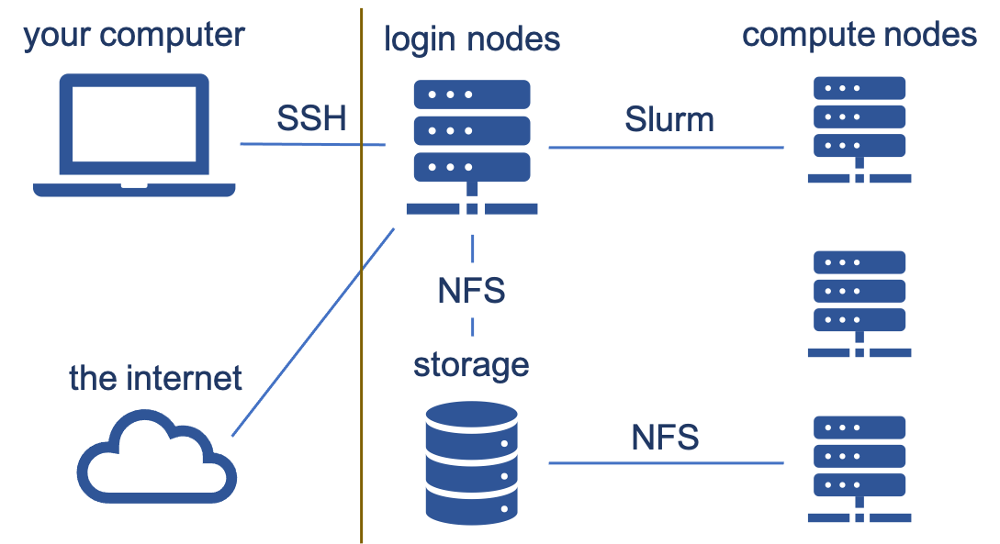
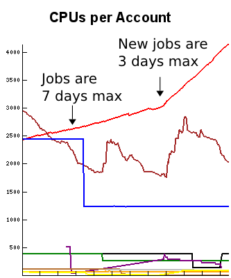
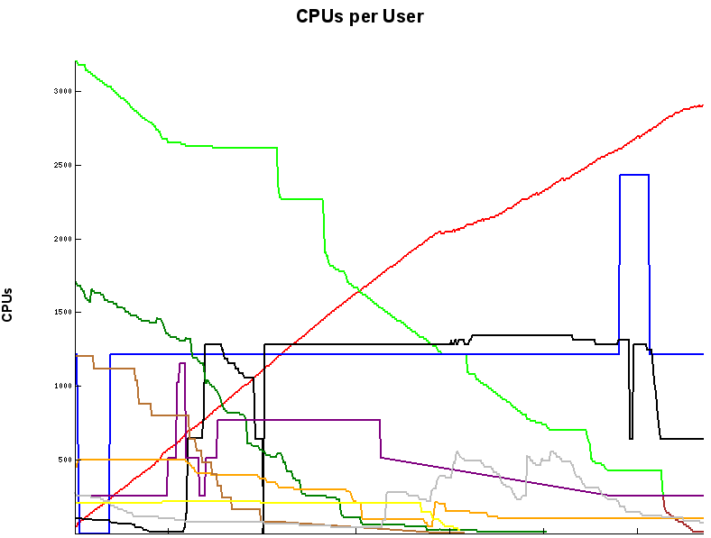
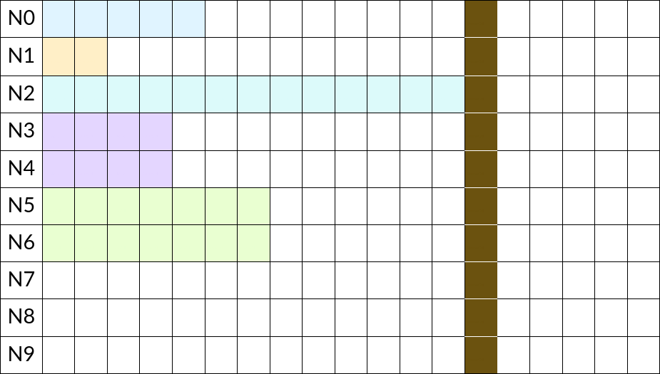

---
---

# Job Schedulers

Job schedulers control access to limited resources such as CPUs, memory, and time. A job is a unit of work and could be as simple as running a program on a certain input file. Users submit jobs to the scheduler, and then the scheduler decides where and when to run user jobs. Our cluster uses [Slurm](https://slurm.schedmd.com/); **you can refer to [our wiki page on it](https://rc.byu.edu/wiki/?id=Slurm) for specifics on its usage**.

<iframe width="560" height="315" src="https://www.youtube-nocookie.com/embed/U42qlYkzP9k?si=2GEQmAvYE_76YPKa" title="YouTube video player" frameborder="0" allow="accelerometer; autoplay; clipboard-write; encrypted-media; gyroscope; picture-in-picture; web-share" allowfullscreen></iframe>

Slurm is both a resource manager and a work scheduler. It's nearly ubiquitous in its use. Using a restaurant analogy, a work scheduler is like a hostess in a restaurant who decides where and when to seat you (How many people? Are there special requirements such as booster seats? Inside or outside seating?). A resource manager is like the server who actually takes your order and brings your food. Back in dinosaur times, schedulers and resource managers were sometimes separate. 

Where does Slurm come in and why do we need a scheduler/resource manager? Slurm controls access to the compute nodes on our cluster. You connect to the supercomputer (a login node) via SSH (secure shell); everything right of the brown line in the image is the supercomputer. Login nodes are for looking at/moving around your data, downloading/uploading data, submitting jobs, but NOT for heavy computation since long-running tasks get killed. Instead, you want to submit jobs where you are doing your computation via Slurm (sbatch, salloc, srun ). You choose the amount of time, memory, cores, etc. Jobs run on compute nodes which have no internet access. There are about a thousand of them with around 40,000 total cores as of this writing.



Each compute node runs `slurmd`. `sbatch` submits a job to the scheduling system's controller, `slurmctld`. The controller finds free resources or schedules the job to run when resources will become available. When it is time to launch the job, the controller sends the job to the `slurmd` running on the chosen compute node. Then `slurmd` runs the script that the user submitted.


## Priority

Which jobs should get priority in a queue for limited resources? The priority can change over time and is reevaluated frequently, typically once per minute. Job priority can be viewed in Slurm with `squeue`. Look at the output options on the man page for it.

```markdown
# Priority is represented as a numeric value per job:
JOBID    USER     PRIO
12423    jim       837
12711    pam       913
12812    pam       904
12813    pam       904
13811    dwight     12
```

Priority can be based on several factors:

- Fairshare (based on historical usage and discussed later)
- Queue time (aka Age)
- Job size
- QOS (Quality of Service)
- others...

You can use the `sprio` command to see these values in Slurm. 

How should jobs be prioritized? Consider these questions:

- Should anyone be able to run as much as they want for three months in a row while no one else gets work done?
- Should every user be guaranteed to have 10 nodes waiting for them all the time, despite the fact that we have hundreds of users?
- Should every user be guaranteed to have access to 5 nodes within 5 hours?
- Should we treat colleges equally? Or should  we treat faculty equally? Maybe each and every user is equal?
- Should a user with a paper submission deadline be treated specially?
- Should 1000 single-core jobs that can easily fit around existing jobs have the same priority as a single 1000 core job that's harder to schedule? 
- How much (if any) priority boost should go to someone who helped purchase hardware? 

The simplest answer to determine priority is first-in, first-out (FIFO). Think of this as a line at a cash register. However, this is too simple to work fairly in reality. You could also give higher priority to those who haven't used many resources lately.

We use the [Fair Tree](https://slurm.schedmd.com/fair_tree.html) algorithm (which we developed at BYU and is now the standard algorithm): priority determined first by research group, then within the research group. Priority for a given job is proportional to $$\sum_i \text{factor}_i \times \text{weight}_i$$.

### Fairshare

The best Fairshare algorithm is Fair Tree. There are two components to it: historical usage and shares.

**Historical usage** is based on resources allocated * time. If you request 1000 cores and use just 1 core, you get charged for 1000 cores. Slurm can have separate charge rates for CPUs, memory, GPUs, licenses, etc. This decays over time until it reaches zero, meaning recent usage affects fairshare more than older usage.

**Shares** are your slice of the resource pie relative to other users. At BYU, we treat all research groups equally. Your professor then determines your share relative to other members of your research group.


## Limits

What are some things you might put limits on in a scheduler? Simultaneous jobs? Number of jobs run in a week or month? Total memory? Total special resources like GPUs? Most limits can be set per account, per user, or per job (e.g., job count, node count, core count, etc.). One limit that deserves special attention is `GrpTRESRunMins`, formerly referred to as `GrpCPURunMins`. 

### `GrpTRESRunMins`

Limits can be set on the number of nodes or cores that a user can use, but this often gets messy and can be difficult for some groups. What if a user needs to run on 1020 cores for only four hours, but the CPU core limit is 1000 cores? Meanwhile another user can run individual jobs on 1000 cores for 7 days each.

To help the first user, you could increase the core limit to 1020 cores, but the user with single core jobs benefits too and that probably isn't what you want in this case. The first user only needs 4080 core-hours (1020 cores * 4 hours) at a time. The second user benefits by an additional 3360 core-hours (20 cores * 168 hours) due to the limit increase. Additionally, this doesn't limit the first user to only using 1020 cores for four hours; the user can also run a 1020 core job for a full 7 days, and maybe you don't want that either.

Instead of using limits on core count or node count, a different limit is needed. `GrpTRESRunMins` can be used to limit CPU cores, memory, nodes, GPUs, etc. in a special way. In our discussion here, we will only mention its affect on CPU cores.

`GrpTRESRunMins` makes using the supercomputer less annoying for pretty much everybody. It is the sum of each job's cores in use * time remaining. As jobs get closer to completion more jobs can start because the time remaining decreases. This encourages shorter walltimes.

To illustrate, the graph on the left shows a real user's usage over time (time is on the x-axis). He used to submit 7 day jobs but decided to drop the walltime to 3 days. After dropping the walltime, new jobs started more quickly and he was able to use more total cores than if he had left the walltime at 7 days. The graph on the right shows what happens when his jobs (green–top left to bottom right) were ending and no new ones were starting because a higher priority user (red) started running jobs. Note how the red user (bottom left to top right) was able to start some jobs quickly because the green user's jobs were staggered. GrpTRESRunMins benefits both the heavy user as well as occasional users. Heavy users can use more and occasional users can get started more quickly.

**tl;dr shorten your walltimes if you can**.

<p float="left">
  
   
</p>


## Backfill

**Backfill** refers to the process of filling in the gaps between bigger jobs with smaller jobs, basically just like using sand to fill in the void between a jar full of pebbles. 

Schedulers try to avoid idling nodes. Smaller jobs start faster as backfill will put small jobs in gaps between big jobs. Let's look at the following example. Each row represents a node/server. The transparent cells are unscheduled time whereas the colored cells represent job allocations. The same color is one job each, but can span several nodes as is the case with purple and green.



Note the brown job that requires all 10 nodes. The soonest it can be scheduled is after the job on N2 is complete. This is what regular scheduling looks like. Lots of wasted time! Let's say you wanted to run a job that requires 18 hours on 1 node. Based on the current schedule, when/where can it run? It can't start until after the brown job has finished! But, if you can reduce your walltime to 6 hours, you can start immediately on N7. This is what backfill looks like: starting a lower priority job before a higher priority job in such a way that it doesn't delay the start of the higher priority job. 

Breaking up your jobs into even smaller units of time (i.e., less than 6 hours) means 13 of your jobs can start on 10 nodes before the 10-node job starts! You'll want to check out your [job stats](https://rc.byu.edu/account/stats/job/) page to see if you can reduce your job size. This example may seem contrived, but it really does happen, especially if you need a scarce resource like GPUs or huge memory.

In review, to take advantage of backfill:

- Break up your jobs into shorter jobs.
- Choose accurate walltimes, but don't underestimate or your jobs will be killed.
- Don't make them too short. If you are doing a lot of jobs, then at least 1 hour is preferred. If you only have a few, it doesn't matter very much.


## Using Slurm

Read the [submitting jobs](https://rc.byu.edu/wiki/?id=Slurm#submitting-jobs) and [preemption](https://rc.byu.edu/wiki/?id=Slurm#preemption) sections of our wiki article on Slurm. Know what `sbatch`, `salloc`, `sacct`, `squeue`, and `scancel` do.
