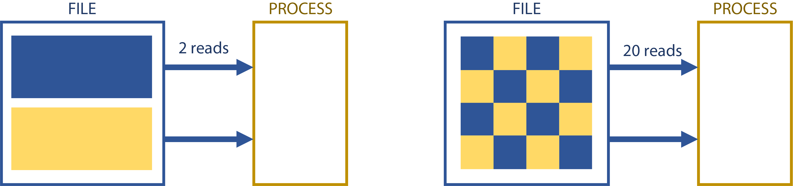

---
---

# Storage

How you store and access data from storage has a great effect on how quickly you can read/write data, and how efficiently you store the data (i.e., how much space it takes up). There are several steps that can be used to optimize both factors.

At the scale of the project for this class, you probably won't have a problem, no matter how you read and write. With real-world data and sizes, though, it can be a big deal.


## Measuring Storage

The most important measures of a storage system are:

- **Capacity**: how many [MiB/GiB/TiB](https://ozanerhansha.medium.com/kilobytes-vs-kibibytes-d77eb2ff6c2a) the system can hold
- **Bandwidth**: the data transfer rate the storage can sustain
- **IOPS**: the amount of I/O operations the system can perform per second


## I/O Patterns

When you access a file, either for read or write operations, how much you access at a time is extremely important. Each read incurs a certain penalty, no matter how much data is accessed. Accessing 1MiB of a file 10 times is slower than accessing 10MiB once.



Each file operation has a certain amount of overhead. If you're doing small numbers of large block I/O, you're most likely to hit the bandwidth limit first; if you're doing lots of small block I/O, you're most likely to hit the IOPS limit of the storage first. Effectively all storage can do large-block transfers pretty well, but no storage system does IOPS really well except in very specialized (and usually expensive) cases. 

The following program, which counts the number of one bits in a file, demonstrates how deleterious random I/O is:

```c++
#include <algorithm>
#include <numeric>
#include <vector>
#include <filesystem>
#include <fstream>
#include <iostream>
#include <random>
#include <bitset>

// Count the number of one bits in the file supplied as the first argument
// Compilation: g++ -std=c++20 -O3 [-DBE_STUPID] -o count_one_bits count_one_bits.cpp
// Usage: count_one_bits myfile
int main(int argc, char **argv) {
    // Create a vector of indices
    const auto file_size = std::filesystem::file_size(std::filesystem::path(argv[1]));
    std::vector<size_t> indices(file_size);
    std::iota(indices.begin(), indices.end(), 0);
    std::mt19937 generator{std::random_device{}()};
    std::ranges::shuffle(indices, generator);

    // Open infile
    auto f = std::ifstream(argv[1]);

    // Count number of "on" bits in infile
    size_t sum = 0;
    for (auto i: indices) {
        #ifdef BE_STUPID
            f.seekg(i);
        #endif
        char byte;
        f.read(&byte, sizeof(byte));
        sum += std::bitset<8>(byte).count();
    }

    // Print the count and exit
    std::cout << sum << std::endl;
    return 0;
}
```

When compiled and run on a random 25 MB file on my desktop, it took less than 1 second when compiled normally, and over 50 seconds when compiled with `-DBE_STUPID` (which causes the bytes to be read in random order rather than sequentially); the contrast is more stark with larger files. It may be worth trying on different filesystems that you have access to so you can get an idea of how punishing small, random I/O is in general.


## Storage Capacity and Small Files

Whenever you `flush()` or `close()` a file, the host has to empty its file cache (in RAM) to disk. If you do so too often, you negate any benefit of the RAM caching your I/O. Using lots of small files means you're doing this by definition. Combined with many jobs, this can cause storage to bog down fairly easily. For example, a user might submit a job array of a thousand tasks that each reads in and processes one file of a few dozen bytes every few milliseconds. Often in such cases there are 10 more seeks for each file read in, meaning that the job array inflicts 3 million IOPS on the storage containing the input files. A storage system up to such a task would cost multiple millions of US dollars, and we kill jobs that bog down our storage systems so.

Small files also use storage inefficiently. Files are stored in 1 or more allocation **blocks**, which are the size of the minimum addressable space on the filesystem. These block sizes can vary between filesystems, but it is usually between 4 KiB and 32 KiB. Unoccupied space in a partially-used block cannot be used by another file. On a system with 4 KiB blocks, a 100 byte file, a 1 KiB file, and a 4 KiB file will each take up 4 KiB.


## Aggregation and Compression

If your data can't be represented as fewer, larger files, you can aggregate and compress it for greater efficiency.

### TAR Files

TAR stands for Tape Archive. They originate from magnetic tape systems where the overhead of lots of small files is even worse. TAR files aggregate multiple files together into a single file similarly to a ZIP file, but without the compression (although it can be compressed). This file contains all the original files' data, and individual files can be extracted as needed. This avoids the space waste overhead from the allocation block issue. Depending on usage patterns, it may help with the access inefficiencies.

The syntax for TAR is as follows:

```shell
# tar file creation; creates test.tar, containing the contents of sourcepath
tar cvf test.tar sourcefilepath/
# view contents of tar file:
tar tvf test.tar
# extract contents of tar file:
tar xvf test.tar
```

Note that the tar command does not remove the original files when it creates the aggregated file. You have to delete the original files manually.

### Compression

In computing, compression refers to taking data and making it smaller. There are many methods for compression. For example, lossy compression, frequently used in media, involves throwing away data you aren't likely to notice (or care about). Once the data is gone, it's gone. There may be a noticeable loss in quality in audio, video, etc., depending on how aggressive the compression is. Generally, we don't like lossy compression for scientific computing since it means losing data in some form. Instead, we can use something like lossless compression.

Lossless compression finds repeating patterns in a file and substitutes those patterns for shorter patterns. In doing so, it also builds a map so that the file can be reconstructed. No data is lost in this method (assuming no file corruption). However, the amount your data can be compressed is dependent on how many repeating patterns are in your file. Genome data compresses extremely well since there are few characters and lots of repetition; binaries don't usually compress well since they're compact and rich in information per byte.

On Linux systems, `gzip` and `bzip2` are most commonly used to compress data; generally, `gzip` is faster and `bzip2` compresses better. You can use them as follows:

```shell
# Compress
gzip  originalfilename
bzip2 originalfilename
# Decompress
gunzip  originalfilename.gz
bunzip2 originalfilename.bz2
```

Unless you specify otherwise, **`gzip` and `bzip2` will replace the original files with their compressed counterparts**. Similarly, `gunzip` and `bunzip2` will replace the compressed version with the uncompressed (original) version.

You can create a compressed tarball in one step, and extract likewise:

```shell
# Create compressed tarballs, gzip and bunzip2
tar cvzf test.tar.gz  sourcefilepath
tar cvjf test.tar.bz2 sourcefilepath
# Tar will automatically decompress while extracting
tar xvf test.tar.gz
```
